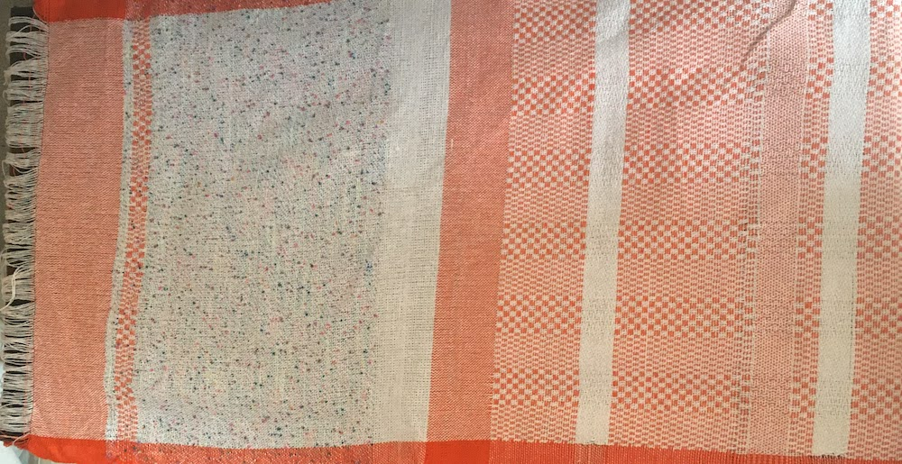

# Documenting

## **Combing**

## **Plying**

Set convention unknown. The materials of each constituent ply and the order in which you plied them. 

## **Braiding**

Set convention unknown. The materials of each constituent material and the order in which you braided them. Often represented as a series of crosses and steps such as: [https://prumihimo.com/resources/braiding-patterns/round-braid/](https://prumihimo.com/resources/braiding-patterns/round-braid/)

## **Knitting**

Knit patterns or machine files   ****

## Wovens

Woven patterns are described by drafts, which are made using a grid structure with each cell of the grid representing the location of a warp and weft crossing each other. As such, these often describe the structure, but not the materials. A black cell denotes that the weft travels UNDER the warp at this location and a white cell denotes that the weft travels OVER the warp at this location.  So if you were going to draft an entire fabric, the number of cells in the width of the draft would  total number of warps in the fabric. The number of cells in the height would represent the number of pics. The convention in weaving is to represent your fabric in the smallest amount of units. Thus, if your entire fabric is made of repeating a series of pics over the width and length of the fabric, then you would represent only the repeating unit with a note at how many times it should be repeated \(or let the weaver decide for themselves\). 

Conventions in drafting have to do with the hardware that one is using for weaving. Often, jacquard looms require each instruction to be specified \(so the draft will represent the entire weave pattern\). Most looms use frames to support quick weaving of repeating patterns, and thus, these drafts often represent those patterns instead of the fabric overall. The draft represents corresponds to actions on a loom and how it relates to a given structure. 

**Drafting For a Tapestry Loom:**

Typically, tapestry weaving involves more complex and hand-involved stitches, and so the drafts often show more than overs and unders, but also show places where you put colors, wrap yarns around eachother, etc. The conventions for this are hard for me to find. When weaving repeating patterns on a tapestry, people often follow the same conventions as a frame draft. [This page offers a nice process of interpreting a pattern step by step](https://www.kaliko.co/blog/weaving-simple-patterns-on-a-frame-loom-tutorial).  

**Frame Loom Draft:** 

This is a draft that I created for my frame loom that shows the primary units that repeat across the width of the fabric. To help with my process, I use non-white to represent any area where the Weft travels UNDER warp, but different shades to different colors of material. The resulting material looked like this \(horizontal is the length/warp\). What is interesting to note is that every section of the weave was created by components of this draft, but that changing materials in both the warp and weft really create the visual pattern. It is also good to reming yourself that when you weave, it will not be square like your draft, thus, you often have to make adjust your draft to what "square" means in your draft. For instance, in the weave below a square was composed of about 20 warps and 30 wefts.  

Yet, above I cropped the most important part out of the picture, which is the part of the draft that represents how to thread the frames, tie up the frames to the treadles, and shows the treadling pattern. If you need a refresher on how the loom works, you can reread the process section for [weaving on heddle-based looms](). So now here is the full picture: 

The top left shows the tie up, the top row shows the threading, and the left shows the treadleing. The grid in the bottom right, shown before, is called the draw down. 

**Interpreting a Draft**

First of all, if you have time, you are free to ignore all the other business and follow the pattern in the lowest and rightmost grid and simply do all the over/undering by hand. So the first row would be over 1, under 1, over 1, under 1 and on and on. The next would be over 1, under 1, and so on. 

If you have a loom with heddles, it will save you immense amounts of time. As such, when you would go to make this pattern on your loom, you would begin with the threading, threading each warp through the frame indicated by the grid. So on this draft, you would thread the left-most warp to the 6th frame, the next to the 5th, the next to the 6th, then the 3rd, 4th, 1st, 2nd, and so on and so forth. Typically, the "first" frame is the one closest to the fabric beam or the front of the loom and they are numbered successively from front to back. Another explanation can be found here: [https://weavingspace.co.uk/blog/threading-draft/](https://weavingspace.co.uk/blog/threading-draft/)

When you are done threading, you would then work on the tie up \(if you're loom has pedals, otherwise you might have to select these frames by hand on each row by raising and lowering levers that raise and lower frames in different combinations. The tie up, thus, represents which frames need to be lifted in any given pic to achieve your desire pattern. So from left to right, I would start by tying frames 1, 2 and 6 to the first treadle. Then I would tie 3,4, and 6 to the next treadle. Then 2, 4, 6 to the next, and 1,3,5 to the last. You can find additional details here: [https://weavingspace.co.uk/blog/reading-a-tie-up/](https://weavingspace.co.uk/blog/reading-a-tie-up/)

When you sit down at the loom to weave you refer to the left most grid to understand the treadling. This is the order in which you push the pedals \(or lift the levers\) in order to get the pattern represented in the lowest and right most grid. Put another way, it represents the specific pics that have to be repeated to obtain the structure. Here is another explanation: [https://weavingspace.co.uk/blog/treadling/](https://weavingspace.co.uk/blog/treadling/)

#### 

#### Writing a Draft

Sometimes you know the structure you want, but not the machine settings to obtain that pattern. Or you have a textile you want to mimic, but you don't have the draft at all. You can do this by first looking very very closely at the fabric and manually marking the draw-down where you note over and unders. Some people photocopy their fabric and enlarge it to make this simpler, or take apart the fabric row by row to understand the order of threads and over/unders. 

I think the Weaving Space blog offers a nice tutorial on a way of [doing this that is more germane to weavers](https://weavingspace.co.uk/blog/how-to-turn-a-profile-draft-into-a-threading-draft/) but I tend to approach it like a computer scientist. Once you have the draw down you follow an algorithm, told in pseudo-code below: 

* For each column c in the draw down 
  * Look at all the cells  in c and represent the sequence from top to bottom as a bitstring \(e.g. 0 meaning white, 1 meaning black; sequence reading as \(0, 1, 0, 1, 0, ......, 1\)\) 
    * if this if the first column OR the bitstring is DIFFERENT from one you have seen previously:
      * assign it \(fill in the cell\) in the next unused frame in the column c on the above threading pattern. 
    * if you have seen this pattern before
      * assign it \(fill in the cell\) of the column c in the above threading pattern in the same frame row that corresponds to the column of which the pattern is a repeat. 
* For each row r in the draw down
  * Look at all the cells in r from left to right and represent the sequence of cells as a bitstring \(e.g. 0 meaning white, 1 meaning black; sequence reading as \(0, 1, 0, 1, 0, ......, 1\)\) 
    * if this if the first row OR the bitstring is DIFFERENT from one you have seen previously:
      * assign it \(fill in the cell\) in the next unused treadle column in the row r on the  treadling pattern to the left. 
    * if you have seen this pattern before
      * assign it \(fill in the cell\) of the row r in the treadling pattern on the left in the same column that corresponds to the row of which the pattern is a repeat. 
* For each row r in the treading pattern;
  * scan until you find the column that is assigned to this row, call that c
    * look at the draw-down for row r, for each cell in r of the draw-down;
      * if the cell is white, do nothing
      * if the cell is black, locate the assigned threading frame row f that corresponds to that draw down cell, and color the cell at row f and column c in the tie down black.  

## 

