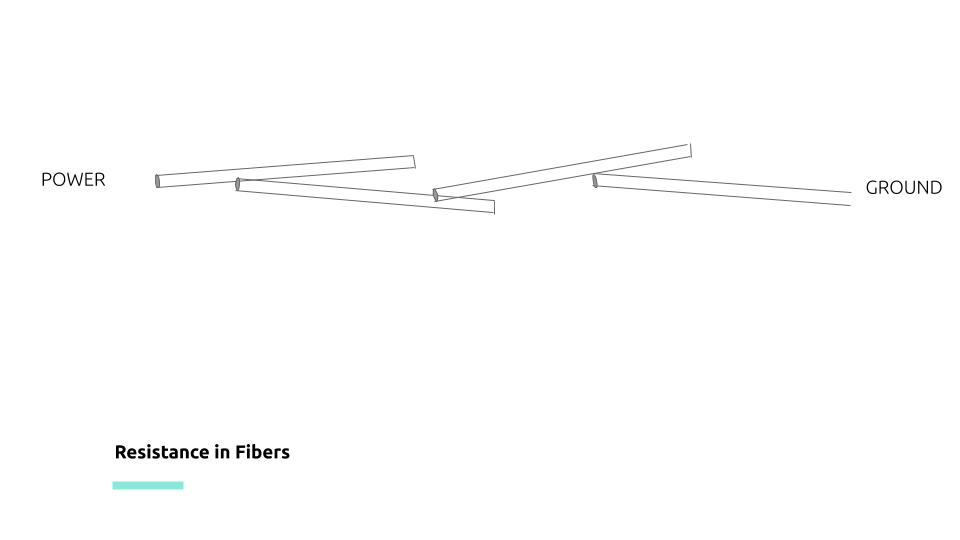

# Circuit Basics

If you remember your grade-school science lessons, you might remember learning about electricity with an example like this: 

\_\_[_Creative Commons_](https://en.wikipedia.org/wiki/Creative_Commons) __[_CC0 1.0 Universal Public Domain Dedication_](https://creativecommons.org/publicdomain/zero/1.0/deed.en)_,_ [_https://en.wikipedia.org/wiki/File:LED\_in\_simple\_Direct\_Current\_Circuit.JPG_](https://en.wikipedia.org/wiki/File:LED_in_simple_Direct_Current_Circuit.JPG)\_\_

Here, the power leaves the battery on the + side, travels across the black lines \(wires\) and then flows through points B, C, D. Along the way, in this example, it encounters, a light and then a resistor become continuing to ground \(-\). This same principle holds in smart textiles, [though we tend to use conductive yarns instead of wires](https://lbruning.com/etextilelounge/scotch-tape-and-conductive-thread/) or we use wires, but we weave or knit them into the structure of the textile, hooking up different components along the way. 

A conductive material is one through which electricity can flow, and they most often include some metallic component. [Lynne Bruning gives an excellent intro into testing your yarns for conductivity](https://www.youtube.com/watch?v=SwiaXMpoy-o). To test, you'll need a [multimeter and SparkFun offers a nice tutorial for how to use a multimeter](https://learn.sparkfun.com/tutorials/how-to-use-a-multimeter/all). For testing conductive threads and yarns, I recommend buying "[minigrabber](https://www.digikey.com/product-detail/en/pomona-electronics/3782-24-02/501-1458-ND/736648?utm_adgroup=Test%20Leads%20-%20Banana%2C%20Meter%20Interface&utm_source=google&utm_medium=cpc&utm_campaign=Shopping_Product_Test%20and%20Measurement_NEW&utm_term=&utm_content=Test%20Leads%20-%20Banana%2C%20Meter%20Interface&gclid=CjwKCAjw2Jb7BRBHEiwAXTR4jYPu0rJsKwnSFFHZf3t3u9UcSv2Ebu5TrewrD8XqVc0xIEi2fsIh1RoC2J0QAvD_BwE)" leads for your multimeter, which make it easier to hold the yarns during testing. 

SparkFun also offers great lessons on this topic as well: 

* [What is Electricity?](https://learn.sparkfun.com/tutorials/what-is-electricity)
* [Voltage, Current, Resistance, and Ohm's Law](https://learn.sparkfun.com/tutorials/voltage-current-resistance-and-ohms-law)
* [What is a Circuit](https://learn.sparkfun.com/tutorials/what-is-a-circuit)
* [Series vs. Parallel Circuits](https://learn.sparkfun.com/tutorials/series-and-parallel-circuits)
* [How to Use A Multimeter](https://learn.sparkfun.com/tutorials/how-to-use-a-multimeter)
* [Metric Prefixes](https://learn.sparkfun.com/tutorials/metric-prefixes-and-si-units)

### Resistance

One of the most critical points to understand for learning smart textile, or when beginning, is a deep understanding of resistance and how it varies \(by shape, temperature, material and cross-sectional area\). This helps us understand how we can use resistance as a way to measure changes to our soft structures and whether or not those changes mean what we think they mean. It will also help in determining your material choice of any conductive materials. I found Khan Academy to be an excellent resource for me to brush up on my understanding of circuitry and resistance in general. Its also worth noting that most circuits we will be describing operate on direct current \(or DC\).       
[https://www.khanacademy.org/science/ap-physics-1/ap-circuits-topic/current-ap/v/circuits-part-1](https://www.khanacademy.org/science/ap-physics-1/ap-circuits-topic/current-ap/v/circuits-part-1)

Resistance is a measure of how easily the electric current as it flows through a length of material. It is measured in Ohms \(Ω\). Materials that carry lots of electricity have low resistance and are called conductive materials. Materials that don't carry electricity easily \(but still move it from A to B\) have high resistance and are called resistive materials. The amount of resistance you measure will be proportional to the length you are measuring \(short lengths of a given material will have a lower resistance than long lengths of a given material -- assuming the materials you are measuring has the same diameter/area and is at the same temperature\). 

### Capacitance

Capacitance is a second principle that is important for smart textiles. Capacitance describes the amount of charge that builds up between conductive objects that are not touching--most often represented as conductive plates. Changes in capacitance tell you how close or far another conductive/grounded object is from your circuit. 

## Sensors

A sensor describes an arrangement of materials that changes its electrical properties in response to some external stimulus \(light, pressure, proximity, electromagnetic fields\). These changes in the electrical properties can be measured by multimeter, micro-controller, and/or computer, and thus, can be used to trigger certain computational processes.  

### Resistive Sensors

Resistive sensors describe a class of sensors who work because of changes in their resistance. These resistance changes often come from a structural change in the materials. Resistive sensing works many times because  electricity will always follow the shortest path from power to ground \(+ to -\). Thus, if a structural change changes the path electricity takes, the measure of resistance will change proportional to the length of the path. 

Consider the example of a conductive thread. Lets imagine we have a staple fiber yarn made of a conductive material, where each little staple fiber conducts electricity and contains a particular amount of resistance.   

## \*\*\*\*

