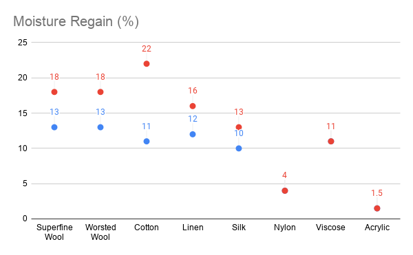

# Comparing Materials

[https://docs.google.com/spreadsheets/d/1YEAAxypWbwPctBzfyNWZ6mH-7f-Pn4piLHHMTRpUJpQ/edit\#gid=0](https://docs.google.com/spreadsheets/d/1YEAAxypWbwPctBzfyNWZ6mH-7f-Pn4piLHHMTRpUJpQ/edit?usp=sharing)

## Comparing Natural Fibers

## Comparing Natural Fibers

| Fiber Type | Superfine Wool | Worsted Wool | Cotton | Linen | Silk |
| :--- | :--- | :--- | :--- | :--- | :--- |
| **General** | \*\*\*\* |  |  |  |  |
| Staple Length: | &gt; 70mm | &lt; 50mm | 10-65mm | 25-150mm | 500-1500m |
| Fiber Diameter: | 19 microns | 22 microns | 11-22 microns | 12-16 microns | 10-13 microns |
| Moisture Regain: | 13-18% \(but can approach 40% in some conditions\) | 13-18% \(but can approach 40% in some conditions\) | 8.50% | 10-20% | 11% |
| Elasticity: | Good \(pretty springy\) | Good | Poor | Poor | Poor |
| Crimp: | Yes | Yes | No | No | No |
|  |  |  |  |  |  |
| **Electrical** | \*\*\*\* |  |  |  |  |
| Conductivity: | Poor | Poor | Poor |  | Depends Largely on Humidity |
| Resistivity | \(2.0 ± 0.1\)x10^6 | \(2.0 ± 0.1\)x10^6 | [9.53×10^9](http://composites.utk.edu/papers%20in%20pdf/Fibers-polymer_2016.pdf) |  | \*higher than cotton and wool |
| Anti-Static | Yes |  | Yes | Yes | Poor in Dry Conditions, Good in Wet |
| Thermal Conductivity | Poor \(feels warm to the touch\) - 0.04 \(W/m K\) |  | Good | Highest \(heat resistant - feels cool to touch, does not melt\) | Poor |
|  |  |  |  |  |  |
| **Others** |  |  |  |  |  |
| Fire Resistance | Good |  |  | Very Poor |  |
| UV Resistance | Good |  | Poor | Poor | UV Weakens Fibers |
| Anti-Microbial | Good |  | Poor | Good |  |
| Moisture Wicking | Good |  |  | Good | Good |
| Moisture Absorbant | Good |  |  | Good |  |
| Dry Strength | Good |  | Good | Great | Good |
| Wet Strength | Poor |  | Better | Better |  |
|  |  |  |  |  |  |
| **Sustainability** | \*\*\*\* |  |  |  |  |
| Renewable Resource | Yes |  | Yes | Yes | Yes |
| Biodegrades | 100%, 3-4 months |  | 100% 1week - 1 year | 100%, 2 weeks | Ok, 4 years |

## Comparing Synthetic Fibers

| Fiber Type | Nylon | Rayon \(Viscose\) | Acrylic |
| :--- | :--- | :--- | :--- |
| **General** | \*\*\*\* |  |  |
| Staple Length: | continuous filament | continuous filament | continuous filament |
| Fiber Diameter: | varies on production | varies on production | varies on production |
| Moisture Regain: | 4% | 11% | 1.50% |
| Elasticity: |  | Good | Good |
| Crimp: | can be added | can be added | can be added |
|  |  |  |  |
| **Electrical** |  |  |  |
| Conductivity: | poor |  |  |
| Resistivity | insulator when dry | [3.6\*10^11](https://link.springer.com/article/10.1007/s10570-016-1107-7) |  |
| Anti-Static |  |  | Good |
| Thermal Conductivity |  |  | OK |
|  |  |  |  |
| Others |  |  |  |
| Fire Resistance | OK \(but melts\) |  | Poor, Burns |
| UV Resistance |  |  | Great |
| Anti-Microbial |  |  | ? |
| Moisture Wicking |  |  |  |
| Moisture Absorbant |  |  | Poor |
| Dry Strength | Great | Poor |  |
| Wet Strength | Great | Poor |  |
|  |  |  |  |
| Sustainability |  |  |  |
| Renewable Resource | No |  |  |
| Biodegrades | Poor |  |  |

## Metallic Fiber Comparisons

|  | Silver | Copper | Stainless |
| :--- | :--- | :--- | :--- |
| **General** |  |  |  |
| Staple Length: | continuous filament | continuous filament | continuous filament |
| Fiber Diameter: | varies on production | varies on production | varies on production |
| Moisture Regain: |  |  |  |
| Elasticity: |  |  |  |
| Crimp: |  |  | yes? |
|  |  |  |  |
| **Electrical** | \*\*\*\* |  |  |
| Conductivity: | Highest | High | Good |
| Resistivity | 1.59x10^-8 | 1.68×10−8 | 6.9×10−7 |
| Anti-Static | Good | Good | Good |
| Thermal Conductivity | 406 \(W/m K\) | 385 \(W/m K\) |  |
|  |  |  |  |
| **Others** | \*\*\*\* |  |  |
| Fire Resistance |  |  |  |
| UV Resistance |  |  |  |
| Anti-Microbial |  |  |  |
| Moisture Wicking |  |  |  |
| Moisture Absorbant |  |  |  |
| Dry Strength |  |  |  |
| Wet Strength |  |  |  |
|  |  |  |  |
| **Sustainability** |  |  |  |
| Renewable Resource | No | No | No |
| Biodegrade | No | No | No |

## Sources

| [http://hyperphysics.phy-astr.gsu.edu/hbase/Tables/thrcn.html](http://hyperphysics.phy-astr.gsu.edu/hbase/Tables/thrcn.html) |
| :--- |
| [http://hyperphysics.phy-astr.gsu.edu/hbase/Tables/thrcn.html](http://hyperphysics.phy-astr.gsu.edu/hbase/Tables/thrcn.html) |
| [http://hyperphysics.phy-astr.gsu.edu/hbase/Tables/rstiv.html](http://hyperphysics.phy-astr.gsu.edu/hbase/Tables/rstiv.html) |
| [https://www.woolmark.com/about-wool/science/wool-is-biodegradable/\#:~:text=How%20long%20does%20wool%20take,taken%20up%20by%20growing%20plants.](https://www.woolmark.com/about-wool/science/wool-is-biodegradable/#:~:text=How%20long%20does%20wool%20take,taken%20up%20by%20growing%20plants.) |
| [https://edgexpo.com/2017/09/05/edge-fast-fact-non-biodegradable-clothes-take-20-to-200-years-to-biodegrade/\#:~:text=It%20may%20take%20between%2020,usually%20takes%20about%205%20months.](https://edgexpo.com/2017/09/05/edge-fast-fact-non-biodegradable-clothes-take-20-to-200-years-to-biodegrade/#:~:text=It%20may%20take%20between%2020,usually%20takes%20about%205%20months.) |
| [https://www.close-the-loop.be/en/phase/3/end-of-life\#:~:text=LINEN,the%20fabric%20into%20small%20pieces.](https://www.close-the-loop.be/en/phase/3/end-of-life#:~:text=LINEN,the%20fabric%20into%20small%20pieces.) |
| [https://www.chaffree.com/wicking-versus-moisture-absorbing-fabrics/?cn-reloaded=1](https://www.chaffree.com/wicking-versus-moisture-absorbing-fabrics/?cn-reloaded=1) |
| [https://www.linenfabrics.co.uk/linen-fabrics-wholesaler-properties-of-linen](https://www.linenfabrics.co.uk/linen-fabrics-wholesaler-properties-of-linen) |
| [https://journals.aps.org/pr/abstract/10.1103/PhysRev.18.356\#:~:text=The%20values%20obtained%20are%20greater,%2C%20all%20times%2010%E2%88%926.](https://journals.aps.org/pr/abstract/10.1103/PhysRev.18.356#:~:text=The%20values%20obtained%20are%20greater,%2C%20all%20times%2010%E2%88%926.) |
| [https://www.voguebusiness.com/sustainability/fashion-biodegradable-material-circularity-cotton\#:~:text=Signs%20of%20degradation%20appear%20in,just%2012%20to%2024%20months.](https://www.voguebusiness.com/sustainability/fashion-biodegradable-material-circularity-cotton#:~:text=Signs%20of%20degradation%20appear%20in,just%2012%20to%2024%20months.) |
| [https://spectrum.ieee.org/semiconductors/materials/spider-silk-weaves-new-path-for-electronics](https://spectrum.ieee.org/semiconductors/materials/spider-silk-weaves-new-path-for-electronics) |
| [https://textilecalculation.blogspot.com/2015/08/standard-moisture-regain-and-moisture.html](https://textilecalculation.blogspot.com/2015/08/standard-moisture-regain-and-moisture.html) |

