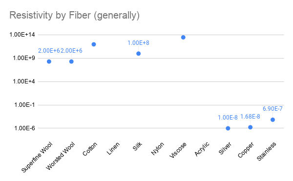
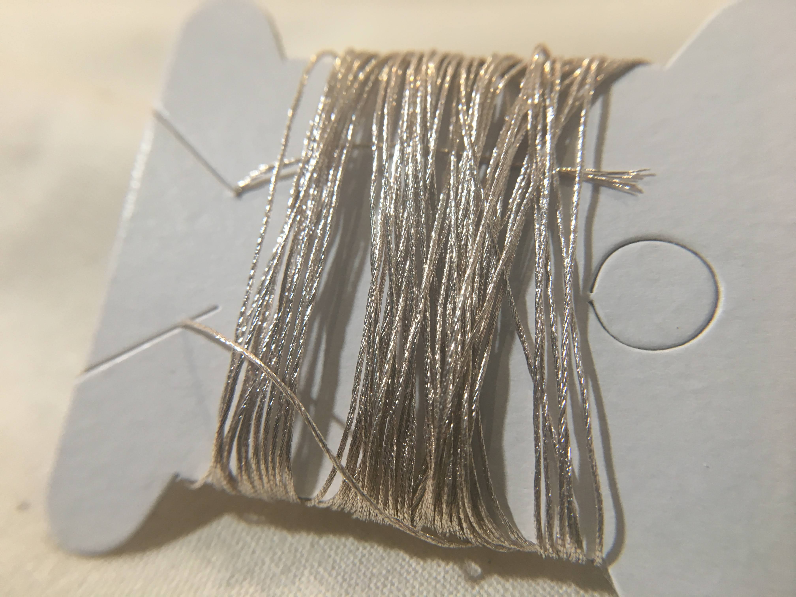

# Metallic Fibers

Metallic fibers are those that conduct electricity and are often blended, as fibers or filaments with non-conductive fibers to make workable yarn. 

The table below represents the resistivity of metallic yarns in comparison to other natural and synthetic fibers. The metallic fibers numbers are consistently measured where the other numbers should be taken with a VERY BIG grain of salt as I wasn't able to find consistent measurements across fibers so they represent whatever I could find anywhere. 

The table below shows that silver is the least resistive \(most conductive\), copper than stainless \(with some in between, but I just included these fibers since they are the most commonly sourced. 

## **Copper**

Copper is typically a good material that can be found in lots of form factors, in solid form or plated/wound, insulated and uninsulated and is generally cost effective. Most copper filament is sold as "magnet wire" and available in many diameters. I find 38 AWG magnet wire most workable in terms of strength and flexibility. Copper yarn is also a bit more cost effective than silver for roughly similar conductivity. 

These images show a detail of the Karl Grimm Kupfer Blanc 7x1 solderable copper yarn \(7 strands, 1 ply\). You can in the magnified structure that it is a thin sheet of cotton wound around 7 individual cores of a different material. 

### Manufacturing:

Here is the only video I could really find showing how copper is changed into very thin magnet wires. [https://www.youtube.com/watch?v=mAVgcVCCxQ8](https://www.youtube.com/watch?v=mAVgcVCCxQ8)

## **Silver**

Silver is said to have anti-odor and anti-bacterial properties that make it popular in athletic wear and other applications. Because its highly conductive, it will feel cool to the touch. Much of the silver conductive yarns sold are other materials like polymers that have been silver plated, instead of solid silver. This method will determine exactly how conductive your silver yarn will be. 

Below we show several ways that silver is integrated into yarn below: 

In this "[Silver Spun"  product](https://www.jimmybeanswool.com/knitting/yarn/FeelGoodYarn/SilverSpunreg.asp?showLarge=true&specPCVID=89997), silver \(5%\) is plied with combed cotton \(87%\), Nylon \(5%\) and Spandex \(3%\). It is very soft and stretchy. 

The microscope image and my guess from the percentages seems to suggest that a silver plated nylon is plied with cotton/spandex singles. 

Karl Grimm also makes a solderable silver yarn in the same 7x1 configuration as the copper show above. It also looks as though a sheet of silver is wrapped around a core within each of the 7 singles that make up the yarn.

Silver also is the material used in this more resistive yarn provided by [V Technical Textiles](http://www.shopvtechtextiles.com/23534-dtex-2-ply-High-Conductive-Twisted-Yarn-B_p_139.html) shown below. 

This image shows that many individual strands of silver plated nylon are plied together. Because there are so many small fibers and because of the ply, you might expect this yarn's resistance to lower when stretched, as the individual sheets of silver would be more closely touching. 

## Stainless Steel

Stainless is not quite as conductive as copper and silver. It is more often made from stainless roving or fibers, making them a bit coarse and grabby \(making them harder to handsew or more rough to the touch. 

**Sourcing**

<table>
  <thead>
    <tr>
      <th style="text-align:left">Structure</th>
      <th style="text-align:left">Possibility to Source in this Structure</th>
    </tr>
  </thead>
  <tbody>
    <tr>
      <td style="text-align:left">Fiber</td>
      <td style="text-align:left">Possible</td>
    </tr>
    <tr>
      <td style="text-align:left">Roving</td>
      <td style="text-align:left">Available</td>
    </tr>
    <tr>
      <td style="text-align:left">Plied Yarn</td>
      <td style="text-align:left">Available as</td>
    </tr>
    <tr>
      <td style="text-align:left">Braided Rope</td>
      <td style="text-align:left"></td>
    </tr>
    <tr>
      <td style="text-align:left">Filament</td>
      <td style="text-align:left">Unsure</td>
    </tr>
    <tr>
      <td style="text-align:left">Knit</td>
      <td style="text-align:left">Available as &quot;<a href="https://www.knitted-mesh.com/products/knitted-mesh-fabric.html">Knitted Mesh</a>&quot;</td>
    </tr>
    <tr>
      <td style="text-align:left">Woven</td>
      <td style="text-align:left">Available as &quot;<a href="https://www.darbywiremesh.com/t-304-stainless-steel-mesh/">Woven Mesh</a>&quot;</td>
    </tr>
    <tr>
      <td style="text-align:left">Non-Woven</td>
      <td style="text-align:left">
        
Available as &quot;<a href="http://www.scrubble.com/products/steel-wool/">Steel Wool</a>&quot;

        
and &quot;Non-Woven Abrasive Pads&quot;

      </td>
    </tr>
  </tbody>
</table>

Conductive Materials, like stainless steel, can be purchased as roving and hand spun:  
[https://www.mielkesfiberarts.com/product/stainless-steel-conductive-fiber/](https://www.mielkesfiberarts.com/product/stainless-steel-conductive-fiber/)

I was able to pur

