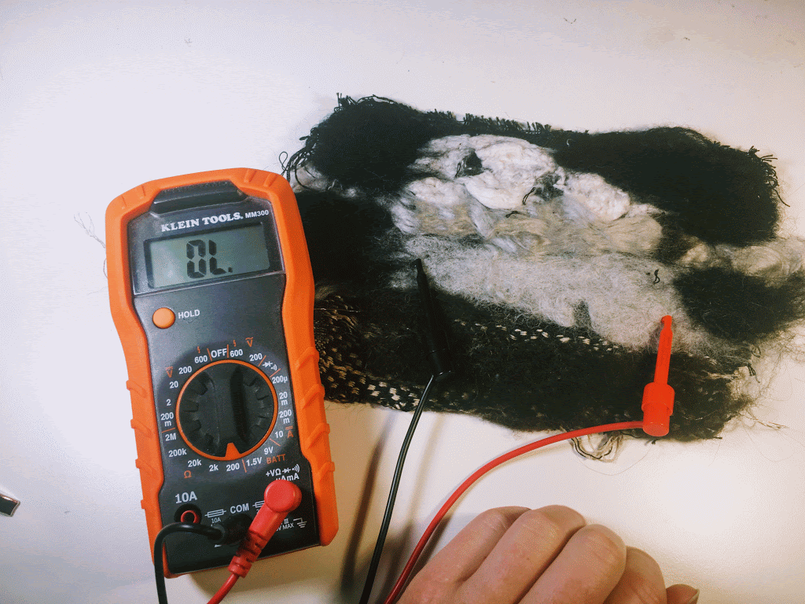

# Felting

a process of creating non-wovens that directly tangles fibers to create a fabric.

## **Needle Felting**

Needle felting binds fibers to themselves or to a textile surface through the stabbing or a barbed needle repeatedly through the fabric. This technique can be used for creating surfaces as well as shapes, can create objects entirely out of fibers and/or to add texture/interactivity to the surface of a fabric. 

### Resources

An Introduction to Needle Felting - Tools and Materials - Needle Felting Tutorial  
[https://www.youtube.com/watch?v=Ck6SUiwPGpw](https://www.youtube.com/watch?v=Ck6SUiwPGpw)  
  
Needle Felting with Conductive Materials  
[https://www.youtube.com/watch?v=Q\_nrZX5ng3o](https://www.youtube.com/watch?v=Q_nrZX5ng3o)

## **Wet Felting**

Wet felting is a process of binding fibers to themselves to create a mesh of fibers that forms a more thick and sturdy fabric. Wet felting is essentially what happens when you wash and dry a wool sweater. To do this on purpose, you typically add a collection of \(wool\) fibers of a sushi-rolling mat or other rolling structure. You add your materials, soap, and water, and roll away to turn it into a fabric. 

### Resources

How to Wet Felt  
[https://www.youtube.com/watch?v=qjW7PSXAewk](https://www.youtube.com/watch?v=qjW7PSXAewk)

## **Nuno Felting**

[Nuno felting](https://en.wikipedia.org/wiki/Nuno_felting#:~:text=Nuno%20felting%20is%20a%20fabric,gauze%2C%20creating%20a%20lightweight%20felt.) is essentially wet felting on top of an existing fabric. In nuno felting, fibers are arranged on top of a fabric and then worked slowly into the mesh of the base fabric. This involves soap, water, and a bit more technique in how the fibers are worked and pressed. The entire assembly is rolled in order to help the fibers mesh with the base fabric. 

I tried \(a lazier and home-spun version of\) Nuno this in order to get a sense of how the process would feel. I selected a fabric mesh that I had woven from cotton and silk \(which is thicker than other materials typically used\) and experimented with the felting of several different fibers: cotton fiber, mulberry silk fiber, shoddy, wool, merinox stainless/wool fiber\). I placed my fibers on top of the fabric and in a sushi roller before adding cold \(with a watering can\) and soap \(just dawn dish soap\). I placed a sheet of tulle on top fo the fibers when I worked them to help keep them in place. I worked them by pressing and applying weight \(I didn't have a fancy waffle iron looking thing like they have in some videos\) so I just used a delicata \(its kind of like a round waffle iron\) to rub and roll across the textile :\) I then rolled the entire thing in a towel 100 times. When I felt the fabric could handle it, I dipped it in hot water and threw that wet sucker on the table a few times, which helped the felt fibers bind to themselves a bit. Part of my testing was to experiment with the wool/stainless steel fibers to see if I could felt a pressure sensor and it worked!

Here is the result, with the multimeter showing the resistance changes on no press, light press, and hard press, ranging from disconnected \(no press\), 698 ohms on light press, and 150 ohms on hard press. Overall, this is a really nice large change it was also a really economical use of the fiber, I didn't have to use that much of my precious steel/wool fiber \(and much less than I have to when I spin it and weave it into the structure\). The black material is the wool, and it bound nicely to the backing. The white fiber is the cotton, whose staple fibers were quite short, so it sort of just clumped on itself. The really shiny silver was silk and it was so lovely, but never really bound with the fibers all that well. The shoddy was a lost cause, just clumped up and did not bind to the fabric so much so that i just peeled it off.  

### Resources

Joan Cornell Simple Scarf  
[https://www.youtube.com/watch?v=I0ZybwUs2jQ](https://www.youtube.com/watch?v=I0ZybwUs2jQ)

Joan Cornell Sari-Silk Jacket  
[https://www.youtube.com/watch?v=lK8sKVYCUr8](https://www.youtube.com/watch?v=lK8sKVYCUr8)

Nuno Felted waistcoat  with Svetlana Vronskaja \(attention to volume and sculpting\)  
[https://www.youtube.com/watch?v=xfCNBo2R45c](https://www.youtube.com/watch?v=xfCNBo2R45c)  
  
Nuno Felting Flat Sheets  
[https://www.youtube.com/watch?v=B3nZ4jEJpHk&t=306s](https://www.youtube.com/watch?v=B3nZ4jEJpHk&t=306s)  

