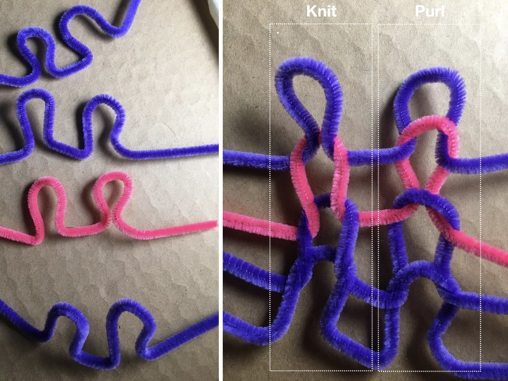

# Knitting

Knitted structures are produced through combinations of two primary stitches \(knit and purl\). Those stitches, used in particular combinations and will particular equipment, give rise to all knitted fabrics and can be used to make flat surfaces or shapes of an arbitrary volume.  These structured are most often achieved through the use of [needles or hooks manipulated by hand](hand-knitting.md) or [machine](machine-knitting.md), as each stitch is essentially a method of pulling one loop through another loop. Knits and an inherently stretchy structure that can easily unravel.

| Structure | Ability to be Knitted |
| :--- | :--- |
| Raw Fiber | no, needs to be in the form of singles first |
| Filament | yes |
| Roving & Top | yes, for a more open and loose structure  |
| Singles | yes |
| Plied Yarn | yes |
| Braided Rope | yes |
| Knits | yes for tubular knits or narrow flat knits |
| Woven | yes for narrow, flat, or tubular weaves |
| Non-Wovens | yes, if sliced or rolled into thin long pieces |
| Solid Objects | yes, if its something you can thread through  |

## General Process

### **Selecting Yarn and Needle Size**

This process will vary if you are working by [hand](hand-knitting.md) or [machine](machine-knitting.md) as hand knitters have more flexibility to adjust these parameters than machine knitting, which often have them fixed. 

### Casting On

The first step in knitting casting on, which means creating the first row structure that you will build your stitches upon. 

### Knitting

Knitted structures, whether made by hand or machine,  are created through combinations and patterning of two knitted stitches: **knit** and **purl**.

 A stitch that appears on one side of the fabric as a "knit" will be read as a "purl" from the back of the fabric. When looking at the front face of a fabric, the knit stitches are those that have their "arms" or sides of the loop on the surface \(and their "necks" on the backside\). Purls are those with their arms on the back side of the fabric and their necks on the front \(as shown in b\). 

\*\*\*\*

**Rib Stitch**: If we are to read \(c\) from the bottom row, left you right, we would read "knit, purl, knit, purl" and the same for the subsequent rows. This combination is a ****"rib" stitch and its commonly found at the end of your sleeves on sweaters or collars. Rib stitches are good for stretching and compressing along its width.

**Garter Stitch**: In \(d\) we would read the bottom row as all knits, the next row as all knits, and on and on. This is called a **garter stitch** and its created by stitching all knit or all purl. 

**Stockinette Stitch**: Another common structure is a **stockinette**, which is creating by alternating knit and purl along each row.  So, one entire row is knit purl across its length, the next knit, the next purl etc. 

### Cast Off

The last step in knitting is the bind off, which secures the structure from unraveling. 

### 

