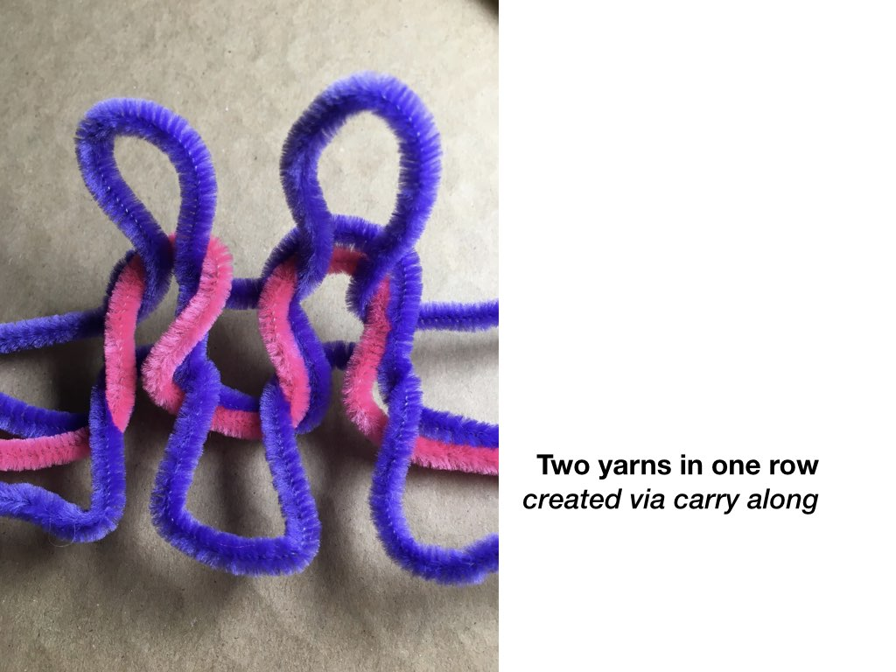

# Hand Knitting

Hand knitting takes place with knitting needles, manipulated by the hands. This technique allows for playful discovery of stitches and structures and, depending on the kind of needle, can be used to knit surfaces, tubes, or volumes.  The material, gauge, stitch, and needle size all shift the texture of the knit itself, giving way to more stretchy, bully, light, or rigid textures. Textures in handknitting can change at any point in the process across the surface by changing the stitch. This is how you can create one garment with different properties in different regions.

## Process

### **Selecting Yarn and Needle Size**

The relationship between the gauge of your yarn \(e.g. how thick it is\) and the size of your knitting needle determines the drape or hand of your knitted textile. Most skeins of yarn will recommend a knitting needle size, but there are ways to play around with knits to create textiles that have multiple properties. For instance, you can use multiple needles when knitting, and change the tension of the knit as you are working. One could use a chunky yarn with a small needle to create a dense knitted textile. Or a lace weight yarn with large needles to create a very loose, soft textile. One fabric can change from densely knitted to and large open knit just by changing needle size. 

For instance, I knitting a small 10 stitch x 10 stitch stockinette swatch using three different US needle sizes, 19, 8 and 4 and the image below shows the results. The \(poorly knit\) swatch on the left had the largest needles \(at 19\) and resulted in the loosest structure. The center swatch was knit with the recommended needle size \(8\) and the swatch on the right was size 4. All swatches were stretchy with the most open structure stretching the most radically. 

### Casting On

The first step in knitting casting on, which means creating the first row structure that you will build your stitches upon. Different methods for casting on will add different properties to your knit piece. For beginners, it might be best to start by focusing on the Long-Tail cast on demonstrated in this video by [Wool and the Gang](https://www.youtube.com/watch?v=T-gdAUEjQjU). 

### Knitting

As you knit, you will be able to vary the combinations of your stitches \(ordering of knits and purls\) used to create different textures, values, and material integration within your swatch.

#### Surface Texture

Surface texture describes small scale changes in volume and structure that give the fabric surface a certain visual  \(bumpy, smooth\) and mechanical \(directional stretch\) texture

As you knit, you will be able to vary the combinations of your stitches \(ordering of knits and purls\) used to create different textures within your swatch. We highly recommend the beginner's series by [Wool and the Gang](https://www.youtube.com/playlist?list=PLMrqriQMGoJhWtXwTUL_Uxm-wZEaUYKR9). Beginners will want to focus on mastering the basic knit and purl stitches, then may experiment with stockinette, and then can go wild attempting different stitches and combinations. You can also find more stitches at the links below: 

A useful collection of beginner-level knitting structures  
[https://www.studioknitsf.com/stitch-patterns-beginner/](https://www.studioknitsf.com/stitch-patterns-beginner/)

Stitchionaries: Compendia of many types of stitches and techniques:   
[https://store.vogueknitting.com/p-126-vogue-knitting-stitchionary-vol-1-knit-purl.aspx](https://store.vogueknitting.com/p-126-vogue-knitting-stitchionary-vol-1-knit-purl.aspx)

#### Volume

Volume describes the overall shape of the knit structure, like a sock or even an [arbitrary 3D shape](http://www.isc.meiji.ac.jp/~yuki_i/knitty/index-e.html). These larger volumes are made through combinations of [increasing](https://www.youtube.com/watch?v=dZXuTacR7NA) and [decreasing](https://www.youtube.com/watch?v=VCud305iPVw) stitches, which essentially allow you to add or remove value in certain regions. Other more complex structures and pockets can be created through methods of double knitting. 

  **Integrating Multiple Materials**

While there are specific techniques, [like intarsia knitting](https://www.thesprucecrafts.com/learn-to-knit-intarsia-2116388), focused on the use of different colors and regions of a knit, there are also more ad hoc techniques like switching your yarns every few rows or "carrying along" a second yarn with your base yarn within certain regions as we show below. These can be particularly useful to adding a small conductive wire through your structure within a given region.  

\*\*\*\*

### Bind Off

The last step in knitting is the bind or [cast off](https://www.youtube.com/watch?v=KldVvrGx6lQ), which secures the structure from unraveling. 

## Hand Knit Project Inspiration 

* Knit Steganography \(hiding messages in knitted structures\): [https://www.atlasobscura.com/articles/knitting-spies-wwi-wwii](https://www.atlasobscura.com/articles/knitting-spies-wwi-wwii)
* SkyKnit: A machine learning project for training based on knitting patterns [https://experiments.withgoogle.com/skyknit\#:~:text=SkyKnit%20is%20a%20fun%20project,creative%20ways%20into%20physical%20creations.](https://experiments.withgoogle.com/skyknit#:~:text=SkyKnit%20is%20a%20fun%20project,creative%20ways%20into%20physical%20creations.)
* TU Berlin: Teaching Robots to Hand Knit:  [https://blogs.tu-berlin.de/zifg\_stricken-mit-robotern/](https://blogs.tu-berlin.de/zifg_stricken-mit-robotern/)

