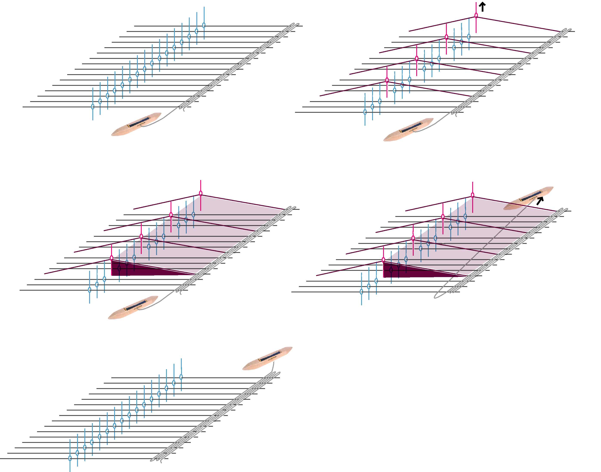

# Weaving

The basic structure of weaving, no matter the type of loom, is the interlacing of yarns. You begin by preparing your warp yarns, or the series of tensioned that you will interlace. These are most often stretched parallel to each other but can also be arranged in other radial or triaxial patterns \(more common in basket weaving\). After these are stretched and of uniform tension, you weave a long thread in and out, or over and under, the warp yarns. The combination of overs and unders and the sequencing will determine the visual and structural nature of your fabric. After adding a row over and under the weft, you can beat or comb it down to form the fabric.  The structure that supports weaving is called a **loom** and techniques vary by the class and type of loom. As Annie Albers writes in her wonderful book "On Weaving",  any woven structure can be realized on any type of loom. The different looms, thus, just make particular actions more or less efficient or allow for different lengths of yarn. I've listed looms and techniques below by complexity. This is not an exhaustive list, but ones that are more common. 

### Selecting Yarn and Looms

When beginning to weave, the materials and equipment are usually considered in tandem. Yarns for warping need to be durable and strong because they are placed under tension during the weaving process. Weft yarns can be just about anything, yet, for most beginning weavers, its good to start with warps and wefts that are of comparable size and materials. 

The weaving density depends on the number of warp yarns per inch across the width of the loom. This is measured in "ends per inch" or epi. Weaving yarns are often soft with a suggestion of ends per inch which ought to match to your equipment. Some looms, like tapestry, rigid heddle looms, or jacquard looms, have fixed positions for you to stretch the warp into or heddles fixed at predetermined position and thus, you must find yarns to match your set up. Alternatively, you can always use less than the maximum density, so long as it still maintains the correct ratios and settings of your equipment. Other looms, like frame looms allow you to vary the density \(though you typically need to find a "reed" for beating that matches your desired density\). Most of the woven clothing you wear will be of a density that far exceeds what is possible on consumer grade equipment \(e.g. 100 epi\). Most craft weaving will consist of something around \(6-20 epi\)

### Warping 

Warping is the process of threading your loom and ensuring warp yarns are of even tension. The procedures for warping depend on the specific type of loom. 

### Weaving: Primary Stitches and Patterns

The diagram below shows the general process of weaving, particularly on a heddle based loom. An understanding of this process aids in explaining the differences in stitches and patterns. 

All woven structures are created from the selection of "unders" and "overs" on any given pic. These patterns are represented by [drafts](../documenting.md#wovens) that represent the minimal repeating unit that characterizes the fabric structure. If the weft travels UNDER the warp \(same as: a heddle lifting that warp \), the draft square is colored solid or black. If the weft travels OVER the warp \(same as: the heddle not being lifted at that warp\), the draft square is colored in white or transparent. Namely, if you repeat these drafts across the weft \(width\) and warp \(length\) of your fabric, you would create a fabric made entirely of that stitch. Stitches can also be alternated or shifted arbitrarily across the length or width, depending on the loom you are using. 

The ordering of these selections has infinite possibilities, but the three most basic structures are: 

**Tabby or Plain Weave**: This is the weave you likely learned in school and made with paper. This is shown in the diagram above. This is where the weft alternates over and under each warp. Each row alternates the order \(so if you stared with an over than under, the next row is under and then over\). Tabby weaves create the most spacing between all the warps and thus the widest and thinest possible structure with any given weft yarn. Tabby weave structures are not stretchy in either direction. Weaving yarns will typically give you a suggested "set" which is how many warps of that yarn would fit in an inch of the resulting fabric. 

**Twill:** Twills are commonly seen in denim. This pattern \(shown in the diagram above\), consists of some repeat of overs and unders  that uniformly shift position along the length, often creating visual diagonal. Twills can be balanced \(meaning that they contain the same number of overs and unders each pic\) or unbalanced \(where the number is uneven\). Unbalanced twills are called weft or warp facing depending on whether the weft travels over more or less warps respectively. The balanced or unbalanced ratio twills will allow them to pack less or more \(respectively\). When wefts are tightly packed, the fabric becomes thicker and more durable \(which is why it is used on denim\). Furthermore, twills create more textured surface structures and can vary in their amount of sheer. Unbalanced twills will also sometimes produce fabrics that curl when removed from tension. When working with different colors in the warp and the weft, the balanced or unbalanced ratio of the twill will produce different levels of shading in the resulting fabric because they modulate the ratio of warp and weft yarns that are visible on the surface. This shading will be inverted or flipped on the bottom side of the fabric. 

**Satin:** Satin stitches are similar to twills in that they can be  unbalanced at each pic, but stain weaves do not uniformly shift to create diagonal lines. Instead, the structures shifts at each row such that the interlacements \(places where a series of unders go under or vice versa\) are never directly next to each other. This creates long "floats" of weft yarns that pack along the surface to create softer fabrics. Satins also exhibit the same shading effects as twill, given their ratios of unbalance and can be weft-faced or warp-faced. The use of satins is typically how regions of contrasting colors are integrated into the structure of fabrics. 

**Many More**: There are so many others, particularly waffle, basket, and birds eye stitches that have really [nice properties particularly when integrating sensing](http://kobakant.at/DIY/?p=6005). 

### Finishing 

Finishing is the process of removing the woven fabric from the loom and fastening the ends so it does not easily unravel. The easiest finishing method \(in my opinion\) is quickly running the ends of the fabric through a sewing machine. Typically, long ends of the warp are exposed on the front and back ends of the fabric, and can be left as fringe,  twisted into tassels, or cut off entirely. 

### Weaving on a Tapestry Loom

[Tapestry looms](https://www.schachtspindle.com/product/tapestry-loom/) are typically frames that allow for yarns to be stretched across their length, and in a fixed length. A weaver can freely weave in and out of the yarns creating more freeform structures and pushing down yarns with a comb. Tapestry looms \(and the resulting tapestries\) can range in size. This video shows an example of [tapestry weaving on a large loom](https://vimeo.com/120200005). Tapestry weaving tends to be the most free-hand weaving processes, and tapestry weavers often freely integrate different materials, colors, etc in non-rectangular shapes. These tapestries often exist as artful wall hangings and rugs. Sheila Hick's collection of tapestries in the book [Weaving as Metaphor](https://yalebooks.yale.edu/book/9780300237221/sheila-hicks) show a large extend of the possibilities of working in this way. Tapestry looms can also be made from ad-hoc materials such as sticks or even eyelashes. The Met offers a nice tutorial on [how historical tapestries were made](https://www.metmuseum.org/blogs/now-at-the-met/2014/making-a-tapestry). 

### Weaving on Heddle-Based Looms

As you might expect, hand threading a yarn over and under every row can be tedious, which has given rise to the development of horizontal looms with **heddles**, or, contraptions that lift the warps for you.  The heddles lift the yarn, and the weaver throws the yarn through the opening, or **shed**, lowers the heddles and beats the row they just laid to meet the fabric. The particular selection of heddles on any given row are called the **pic**. If you are looking to learn, [Peggy Osterkamp is the go to source for learning](https://woolery.com/weaving-for-beginners-an-illustrated-guide.html?nosto=categorypage-nosto-1). Many heddle based looms consist of the use of frames \(which contain sets of heddles\) and treadles which easily allow different frames to be lifted in combination with one another. 

#### Weaving on a Rigid Heddle Looms

Rigid heddle looms often have one frame, making it easy to quickly weaving tabby and inviting the weaver to play with other hand techniques integrated with the tabby. 

**Frame/Shaft Looms**

Frame or Shaft looms are made to fit on table tops or floors and can have 2 to as many as 24 frames, depending on the loom. Frame looms also come in a variety of widths. When warping, the weaver threads each frame with a particular sequence of warps \(most simply, a "straight draw" which takes every 1st warp and puts it on frame one, every 2nd on frame two, every 3rd on frame three \(and so on\). To create a pattern, then, one "lifts" the frames that give them their desired pic. The lifting is done by hand or by the use of treadles, foot pedals that attach to different sets of frames allowing you to select them. Frame looms make it easier and faster to produce repeating patterns. Some frame looms are computer controlled, allowing motors to lift the frame rather than pedals. These are often called dobby looms. The loom shown in the image above is a 8-shaft Floor Loom. Further specifications \(e.g. jack loom, countermarch\) describe the mechanisms that raise and lower the heddles \(and often make it physically easier to do so, especially with large numbers of shafts and or wide widths\). 

#### Jacquard Looms

A jacquard-style loom is one where every heddle can be individually controlled. Originally, they were selected by punch cards \(which inspired the earliest forms of computing\) and today, they are computer controlled with small motors, electromagnets, and or pneumatics. Jacquard style looms fix the position of each heddle, so they typically have a set density they will weave. Jacquard style looms are best for creating non-repeating patterns and more complex woven structures. Most consumer obtainable jacquard looms still require the weaver to remain present at the loom while weaving and to throw the weft yarn \(held on a shuttle\) between the ends of the fabric.

#### Industrial Weaving 

While the looms listed above are common in prototyping and developing and testing structures, Industrial looms produce most woven fabrics on earth today. These looms include mechanisms \(such as a "rapier mechanism"\) that automatically pass the weft yarns through the shed without any human involvement. These machines are incredibly fast and have very high epi's. I have no idea how they warp these machines but it must be wild.  

| Structure | Ability to be Woven |
| :--- | :--- |
| Raw Fiber | yes, if integrated into short regions of the weft, difficult |
| Filament | yes \(for warp and weft\) |
| Roving & Top | yes, if integrated into the weft  |
| Singles | yes \(only in weft\) |
| Plied Yarn | yes \(warp and weft\) |
| Braided Rope | yes \(warp and weft\) |
| Knits | yes for tubular knits,  narrow flat knits, or knits rolled and/or layed flat as weft |
| Woven | yes for narrow, flat, or tubular weaves or rolled wovens into the weft  |
| Non-Wovens | yes, if sliced or rolled into thin long pieces or rolled and placed in the weft |
| Solid Objects | yes, especially if they are long and narrow, if they can be threaded through the weft, or otherwise integrated at weave time into the  pockets of a multi-layered structure. |

