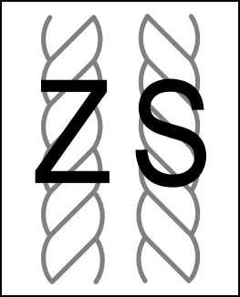

# Processes

## Combing & Carding

Carding yarns  "encourages the fibers to lie in multiple directions" \[yarn-i-tec-ture\] and is referred to as a "woolen" preparation of fibers. Carding fibers produces roving. Fibers of all different lengths are kept in this process. The goal of carding is to build up enough of a "mesh" of fibers that they hold together. These meshes, and the process, yields more airy, fluffy and soft yarns. Bundles of woolen fibers are most often called "roving" but you different preparations go by names batts, rolags, fauxlags, puin, cloud, and wool locks, each of which offers, as you expect, its own set of unique qualities to the fibers.

Combing fibers allows them to all align in the same direction.  This is used on fibers that then to be a uniform length. This preparation of fiber is called "worsted".  It is often used for making yarns that are more uniform, lustrous in color, durable, and a little wirey. Packages of worsted fiber are called "top"

| Structure | Ability to be Combed and Carded |
| :--- | :--- |
| Fiber | yes |
| Filament | no |
| Roving & Top | perhaps? but unlikely |
| Singles | no |
| Plied Yarn | no |
| Braided Rope | no |
| Knits | no |
| Woven | no |
| Non-Wovens | no |
| Solid Objects | sure, but why? |

#### Online Demonstrations 

* [Ask The Woolery: Carding and Combing](https://www.youtube.com/watch?v=3U3fWNJLVyw) 

#### **Text Resources**

* [Yarnitecture: A Knitter's Guide to Spinning: Building Exactly the Yarn You Want](https://books.google.com/books/about/Yarnitecture.html?id=uCe9DAAAQBAJ&source=kp_book_description)

  Book by Jillian Moreno  

## Spinning 

Spinning is a process of adding twist to fibers \(in the form of top or roving\) such that they form into a more structured and "balanced" yarn, which means that it won't un-spin easily. Spinning top or roving  produces [singles](), a single strand of twisted yarn. Singles are unbalanced \(their twist is only in one direction\) and their are not very durable. It is also possible to spin raw fibers around other structures, such as wires or filaments in a process of [core spinning](https://www.youtube.com/watch?v=7nAfv3O_Qrk). 

To spin, a spinner drafts, or feeds, a collection of fibers into their spinning devices \(wheel or spindle\). The spinner users their hands \(or otherwise\) to control the propagation of the spin up the length of the unspun fiber. As the spin propagates along the length of the fiber, it is wound onto a spool. The final step in spinning is called finishing, by which the yarn can be washed, steamed, lassoed, whacked, menaced, and a whole host of other hilarious words, to help the yarn achieve is final state. This is essentially a process of making the yarn resemble the state you want it to stay in and you really don't know much until you've washed and laundered a textile project \(which is always frightening to me\).

| Structure | Ability to be Spun |
| :--- | :--- |
| Raw Fiber | yes, but not in a meaningful length |
| Filament | yes, if integrated as a core |
| Roving & Top | yes |
| Singles | yes, perhaps to add extra spin or customization |
| Plied Yarn | not sure \(add extra twist?\) |
| Braided Rope | not sure \(add extra twist?\) |
| Knits | no |
| Woven | no |
| Non-Wovens | no |
| Solid Objects | no |

### Spinning with a Spinning Wheel

The most common method of spinning requires a spinning wheel \(yes, the machine of fairy tale lore\), which requires a substantial amount of technique and know how to use it effectively. A spinning wheel requires the spinner to use their feet to spin the wheel at an even pace and both their hands to draw the fibers into the wheel. It is faster and produces higher quality yarn than the other techniques. 

#### Online Demonstrations 

* [DIY Conductive Thread on a Spinning Wheel](https://www.youtube.com/watch?time_continue=1&v=vB6aW6PBYAI&feature=emb_title)
* [Navajo Weaver Clara Sherman Demonstrating her Spinning Process](https://www.youtube.com/watch?v=D_p7OIghMVw)

#### **Text Resources**

* [Yarnitecture: A Knitter's Guide to Spinning: Building Exactly the Yarn You Want](https://books.google.com/books/about/Yarnitecture.html?id=uCe9DAAAQBAJ&source=kp_book_description)

  Book by Jillian Moreno

### Spinning with a Drop Spindle

A more accessible method of spinning can be accomplished using a drop spindle. A drop spindle is a modified top that one manually spins in order to add twist to the fiber.  This is an ancient practice that still largely resembles its process from 20,000 years ago. For those interested in how these techniques varied in medieval times by region, you may [enjoy this demonstration of technique](https://www.youtube.com/watch?time_continue=3&v=RERnzaTREyM&feature=emb_title).

#### Online Demonstrations 

* [Spinning on a Drop Spindle, Schacht Spindle Company](https://www.youtube.com/watch?v=mae2CAkrZDo)

**Text Resources**

* TBD

## Extruding

A second common process uses processes of extrusion. In these cases, materials are processed into a liquid like goo \(think play-doh\) and pressed through narrow openings named after a spider's "spinneret." The single streams of material emerging from the spinneret are either spun directly into fiber or deposited into liquid chemical baths as part of their structural formation. Often, extruding gives rise to filaments, where long continuous fibers are created. In other cases, the streams can be kept at deliberately short lengths to simulate more[ staple fiber](structures-1/strtest/staple-fiber.md) like qualities \(think steel wool\).  

| Structure | Ability to be Extruded |
| :--- | :--- |
| Raw Fiber | no |
| Filament | no \(unless reprocessed into an extrudable material\) |
| Roving & Top | no |
| Singles | no |
| Plied Yarn | no |
| Braided Rope | no |
| Knits | no |
| Woven | no |
| Non-Wovens | no |
| Solid Objects | sure, clay, playdough, pasta, etc.  |

#### Online Demonstration

* [How to Make Your Own Nylon ](https://science.wonderhowto.com/how-to/make-your-own-nylon-302534/)
* [DIY Filament Extruder Instructable](https://www.instructables.com/id/Build-your-own-3d-printing-filament-factory-Filame/) \(for 3D printing, but perhaps one can adapt\)
* [Felfil Custom Filament Machine](https://felfil.com/?v=5ea34fa833a1)
* [DIY Extruding using a Syringe](https://www.youtube.com/watch?v=VTFMsty0NiI) \(for polyclay, but can be adapted\)

#### **Text Resources**

* TBD

## Plying

Plying consists of twisting multiple singles together. You can make cores and core-spun yarns using plying, but you cannot make hollow structures. You can ply with 2, 3, or however the hell many yarns you like, but its probably best to stay on the small side \(under 6\) to keep structure if you are doing this somewhat freehand. 

Plying is most often used to make a yarn "balanced." Meaning that the yarn contains twists in two directions that hold it a steady structure.  Thus, plying yarns must occur in the opposite direction that they were spun. The twist of yarns is described as "Z-twist" or "S-twist" and it is a measure relative to your own body. 

If you want to ply yarns together, here is what you do. Each of the singles strands is already contains a twist \(lets say Z-twist\) in one direction. Align all your singles so they are oriented in the same direction \(all Z-twist\) and then join them together by twisting them together in the opposite direction \(the S-direction\). If plying already plied yarns, add twist in one direction  to each strand independently and then, starting from their shared end, twist them in the opposite direction to allow them to form onto each-other. 

| Structure | Ability to be Plied |
| :--- | :--- |
| Raw Fiber | no, needs to be in the form of singles first |
| Filament | yes |
| Roving & Top | yes?, for a more open and loose structure  |
| Singles | yes |
| Plied Yarn | yes |
| Braided Rope | yes \(I don't see why not?\) |
| Knits | yes for tubular knits or narrow flat knits |
| Woven | yes for narrow, flat, or tubular weaves |
| Non-Wovens | yes, if sliced or rolled into thin long pieces |
| Solid Objects | yes, often if integrated as a core and plied around |

### **Plying on a** Spinning Wheel

A spinning wheel is the most common method of plying long lengths of yarn  by craft spinners, as shown in this tutorial  
****

**Online Resources**

* \*\*\*\*[Making a 2-Ply Yarn on a Spinning Wheel](https://www.youtube.com/watch?time_continue=1&v=ibpaZXq1eiU&feature=emb_title)
* [3 Techniques for Plying Handspun Yarn on an E-Spinner ****](https://www.youtube.com/watch?v=Rr2EaFrXqwo)

#### **Text Resources**

* [Yarnitecture: A Knitter's Guide to Spinning: Building Exactly the Yarn You Want](https://books.google.com/books/about/Yarnitecture.html?id=uCe9DAAAQBAJ&source=kp_book_description)

  Book by Jillian Moreno

### **Plying with a Drop Spindle**

A drop spindle can also works for plying as shown in this demonstration of creating a 2x2 ply yarn. 

#### Online Resources

* [Plying Custom Conductive/Color-Changing Yarn](https://vimeo.com/93086189),  ****[Anne-Marie Lavigne](http://emeteuz.com/woven-signals) 
* [DIY Drop Spindle](https://www.youtube.com/watch?v=PKSLiUGJUo8) [Creativebug Studios](https://www.youtube.com/channel/UC5Kp8JjsqrtlqeIF7RgatPg)\*\*\*\*

### **Plying with a Rope Machine**

rope making machines offer a simple assembly for creating multi-strand plys and ropes. 

#### Online Resources

* [Another DIY setup using a power drill](https://www.youtube.com/watch?v=2kQBp_5PPTc&feature=emb_logo)
* [How to use a Schacht Incredible Rope Machine](https://www.youtube.com/watch?v=dJS-92kUicc)

**Text Resources**

* TBD

### **Plying with an Ad Hoc Setup**

You can also ply by hand by twisting any long and durable material in your hands, in one direction, folding it, and gently encourage its natural inclination to spin in the other direction. 

#### Online Resources

* [A DIY Conductive Thread / Rope Machine](https://www.instructables.com/id/Conductive-Thread-Wind-up/) - [Lynne Bruning](https://www.instructables.com/member/Lynne+Bruning/)
* [Demonstration of Plying 6 Strands into Rope on a Large Scale. ](https://www.youtube.com/watch?v=toyOKOi0DsM&feature=emb_title)

**Text Resources**

* TBD

## **Braiding**

Braiding is a technique that uses coils multiple strands, in different twist directions around a solid or hollow core. Industrial braiding uses a machine called a "[maypole machine](https://www.youtube.com/watch?v=SKHuZEhrQ2E)" that is utterly fascinating to watch. Braiding is often used for creating sheaths around a core. What is nice about braiding is you can have a core that is a completely different material than the sheath without having to wrestle with too many different issues in tensioning. I have never worked with an industrial braiding machine, but making braided tubes by hand has opened up a lot of possibilities for experimenting with integrating many different materials. 

| Structure | Ability to be Braided |
| :--- | :--- |
| Raw Fiber | no, needs to be in the form of singles first |
| Filament | yes |
| Roving & Top | yes  |
| Singles | yes |
| Plied Yarn | yes |
| Braided Rope | yes  |
| Knits | yes for tubular knits or narrow flat knits,  you could also braid around a knit object |
| Woven | yes for narrow, flat, or tubular weaves |
| Non-Wovens | yes, if sliced or rolled into thin long pieces or rolled and integrated as core |
| Solid Objects | yes, often if integrated as a core and braided around |

### Braiding with a Kumihimo Disk

Braiding machines have yet to enter the DIY marketplace \([and this one is out of stock!](https://www.kickstarter.com/projects/mixedmediaeng/rope-omatic)\), but we can create small samples at least using a technique called **Kumihimo.** Kumihimo braiding is a technique in which several lengths of yarns are braided into hollow tubes. Kumihimo templates can be used to create braids with custom textures and patterning. The templates are easy to produce in cardboard on a laser cutter at various thicknesses. During this braiding, the maker has more control over tensions than they might with techniques that spin yarns together, thus, they may be ideal for applications that require brittle materials to be integrated into the outer structure of the yarn. It is also nice because it can adapt to several different numbers of individual yarns composing the braid. If you want to braid around a core, you simple pace your core material through the hole in the center and while you are braiding, it will wrap around that core on its own. A special thank you to [Pamela Liou](https://pamelaliou.com/) who was the first to introduce me to Kumihimo. There are many [patterns available online](https://prumihimo.com/resources/braiding-patterns/) that allow you to create braids with different cross sections ranging from square to semi-circular. 

**Text Resources**

* [Prumihimo Braiding Patterns](https://prumihimo.com/resources/braiding-patterns/)

**Text Resources**

* TBD

## Non-Woven Preparations \(Growing, Felting, Papermaking, 3D printing\)

| Structure | Ability to be Grown | Ability to be initegrated into Growth Processes or Grown Upon? |
| :--- | :--- | :--- |
| Raw Fiber | sure | yes? |
| Filament | yes | yes? |
| Roving & Top | no, I don't think you could directly grow rowing  | hummm |
| Singles | no, I don't think you could directly grow singles, though something similar could be  | yes? |
| Plied Yarn | no, I don't think you could directly grow plied yarn, but you could make it from   | yes? |
| Braided Rope | no, I don't think you could directly grow rowing   | yes? |
| Knits | no, I don't think you could directly grow knit  | yes?  |
| Woven | yes, if you scaffold the growth process \(grow in lattice\) | yes? |
| Non-Wovens | yes! you can grow directly to non-woven  | Yes? |
| Solid Objects | sure | chia pet |

**Online Resources**

* [DIY Home Paper Making](https://www.youtube.com/watch?v=Cn69DDYSR3c)
* [Making Your Own Felt ](https://www.youtube.com/watch?v=qjW7PSXAewk)

**Text Resources**

* TBD

#### Inspiration

Suzanne Lee: Grow your own clothes TED talk \(Kombucha Leather\)  
[https://www.youtube.com/watch?v=3p3-vl9VFYU](https://www.youtube.com/watch?v=3p3-vl9VFYU)

Printing, Cutting, Attaching: Iris Van Herpin  
[https://www.youtube.com/watch?v=7tKk11nA\_SY](https://www.youtube.com/watch?v=7tKk11nA_SY)

3D printed fabric structures: Francis Bitonti  
[https://www.youtube.com/watch?v=Aac9RAU9EIk](https://www.youtube.com/watch?v=Aac9RAU9EIk)

3D printed fabrics: Nervous Systems Kinematics Dress  
[https://vimeo.com/113561369](https://vimeo.com/113561369)

Malu Luecking Bio Plastic Non-Wovens  
[https://maluluecking.pb.design/bioplastic](https://maluluecking.pb.design/bioplastic)

## Knitting

Knitted structures are produced through combinations of two primary stitches. Those stitches, used in particular combinations and will particular equipment, give rise to all knitted fabrics and can be used to make flat surfaces or shapes of an arbitrary volume.  These structured are most often achieved through the use of needles or hooks manipulated by hand or machine, as each stitch is essentially a method of pulling one loop through another loop. Knits and an inherently stretchy structure that can easily unravel.

### **Selecting Yarn and Needle Size**

The relationship between the gauge of your yarn \(e.g. how thick it is\) and the size of your knitting needle determines the drape or hand of your knitted textile. Most skeins of yarn will recommend a knitting needle size, but there are ways to play around with knits to create textiles that have multiple properties. For instance, you can use multiple needles when knitting, and change the tension of the knit as you are working. One could use a chunky yarn with a small needle to create a dense knitted textile. Or a lace weight yarn with large needles to create a very loose, soft textile. One fabric can change from densely knitted to and large open knit just by changing needle size. 

For instance, I knitting a small 10 stitch x 10 stitch stockinette swatch using three different US needle sizes, 19, 8 and 4 and the image below shows the results. The \(poorly knit\) swatch on the left had the largest needles \(at 19\) and resulted in the loosest structure. The center swatch was knit with the recommended needle size \(8\) and the swatch on the right was size 4. All swatches were stretchy with the most open structure stretching the most radically. 

### Casting On

The first step in knitting casting on, which means creating the first row structure that you will build your stitches upon. We will show these techniques as they are associated with each link below. 

### Knitting: Primary Stitches & Patterns

Knitted structures are created through combinations and patterning of two knitted stitches: **knit** and **purl**. A stitch that appears on one side of the fabric as a "knit" will be read as a "purl" from the back of the fabric. When looking at the front face of a fabric, the knit stitches are those that have their "arms" or sides of the loop on the surface \(and their "necks" on the backside\). Purls are those with their arms on the back side of the fabric and their necks on the front \(as shown in b\). 

**Rib Stitch**: If we are to read \(c\) from the bottom row, left you right, we would read "knit, purl, knit, purl" and the same for the subsequent rows. This combination is a ****"rib" stitch and its commonly found at the end of your sleeves on sweaters or collars. Rib stitches are good for stretching and compressing along its width.

**Garter Stitch**: In \(d\) we would read the bottom row as all knits, the next row as all knits, and on and on. This is called a **garter stitch** and its created by stitching all knit or all purl. 

**Stockinette Stitch**: Another common structure is a **stockinette**, which is creating by alternating knit and purl along each row.  So, one entire row is knit purl across its length, the next knit, the next purl etc. 

#### Additional Stitches

A useful collection of beginner-level knitting structures  
[https://www.studioknitsf.com/stitch-patterns-beginner/](https://www.studioknitsf.com/stitch-patterns-beginner/)

Stitchionaries: Compendia of many types of stitches and techniques:   
[https://store.vogueknitting.com/p-126-vogue-knitting-stitchionary-vol-1-knit-purl.aspx](https://store.vogueknitting.com/p-126-vogue-knitting-stitchionary-vol-1-knit-purl.aspx)

### Bind Off

The last step in knitting is the bind off, which secures the structure from unraveling. 

| Structure | Ability to be Knitted |
| :--- | :--- |
| Raw Fiber | no, needs to be in the form of singles first |
| Filament | yes |
| Roving & Top | yes, for a more open and loose structure  |
| Singles | yes |
| Plied Yarn | yes |
| Braided Rope | yes |
| Knits | yes for tubular knits or narrow flat knits |
| Woven | yes for narrow, flat, or tubular weaves |
| Non-Wovens | yes, if sliced or rolled into thin long pieces |
| Solid Objects | yes, if its something you can thread through  |

### Hand Knitting

Hand knitting takes place with knitting needles, manipulated by the hands. This technique allows for playful discovery of stitches and structures and, depending on the kind of needle, can be used to knit surfaces, tubes, or volumes.  The material, gauge, stitch, and needle size all shift the texture of the knit itself, giving way to more stretchy, bully, light, or rigid textures. Textures in handknitting can change at any point in the process across the surface by changing the stitch. This is how you can create one garment with different properties in different regions.  

#### Inspiration: 

* Knit Steganography \(hiding messages in knitted structures: [https://www.atlasobscura.com/articles/knitting-spies-wwi-wwii](https://www.atlasobscura.com/articles/knitting-spies-wwi-wwii)
* SkyKnit: A machine learning project for training based on knitting patterns [https://experiments.withgoogle.com/skyknit\#:~:text=SkyKnit%20is%20a%20fun%20project,creative%20ways%20into%20physical%20creations.](https://experiments.withgoogle.com/skyknit#:~:text=SkyKnit%20is%20a%20fun%20project,creative%20ways%20into%20physical%20creations.)
* TU Berlin: Teaching Robots to Hand Knit:  [https://blogs.tu-berlin.de/zifg\_stricken-mit-robotern/](https://blogs.tu-berlin.de/zifg_stricken-mit-robotern/)

### **Machine Knitting**

There are two main types of knitting machines that can used for tabletop knitting. These machines are made possible through "[latchhook needles](https://www.youtube.com/watch?v=ccepDc_4gV4)."  A [flat bed machine](https://www.xdknitmachinery.com/knitting-machine-for-beginners/),  comes in two 'gauges', standard and chunky. The gauge of the machine refers to the spacing between the needles in the bed of the machine, which allows for different size yarns to run through the machine. These machines can be programmed electronically, or via punchcard. Punchcard machines are possible to find at second hand shops or in giveaway piles but need tender love and care to work properly. The second type of knitting machine is a '[V-bed](https://textiles.ncsu.edu/tatm/wp-content/uploads/sites/4/2017/11/Choi_full_145_05.pdf)' machine. V-bed knitting machines allow for more complex stitch structures and for double knits, and seamless knitting. These are more difficult to happen upon but are most common in industrial knitting. The two beds, arranged in a V, are able to pass yarns back and forth across the layers. Another common kind of machine for knitting is a [circular knitting machine](https://www.youtube.com/watch?v=ccepDc_4gV4), where needles are arranged along the edge of a circle to create a continuous tubular knit for objects like hats and socks. Circular knitting machines are readily available in varying levels of quality. 

#### DIY Machines & Inspirations: 

* Kniterate: DIY V-Bed Machine [https://www.kniterate.com/](https://www.kniterate.com/)
* Merel Karhof Wind Powered Circular Knitting Machine:  [https://www.merelkarhof.nl/work/wind-knitting-factory](https://www.merelkarhof.nl/work/wind-knitting-factory)
* Damien Ludi & Colin Peillex Rocking Chair Powered Knitting Machine: [https://www.youtube.com/watch?v=H6m92HRZm2Y](https://www.youtube.com/watch?v=H6m92HRZm2Y) 

**Industrial Knitting:**   
Industrial knitting machines produce the garments that we purchase in stores today. They are programmed via computer and can knit incredibly complex structures, and seamless garments. One machine can do many things and accommodate different yarns, rather than having different machines for different structures and yarns. There are also industrial circular knitting machines that can knit tubes of fabric, spacer textiles, and multilayer knit fabrics. Most industrial knitting machines are produced two one of two brands: [Shima Seiki](https://www.shimaseiki.com/) or [Stoll](https://www.stoll.com/en/). These machines are becoming more popular within university research labs and maker spaces. 

**Machine Knit Structure Inspirations:**

* **Zaha Hadid Architects: Knit Formwork**  [https://www.zaha-hadid.com/design/knitcandela/](https://www.zaha-hadid.com/design/knitcandela/)
* **Pauline VanDongen: Vigour** [http://www.paulinevandongen.nl/project/vigour/](http://www.paulinevandongen.nl/project/vigour/) [https://www.dezeen.com/2015/02/15/vigour-pauline-van-dongen-martijn-ten-bhomer-textiel-cardigan-senses-movement/](https://www.dezeen.com/2015/02/15/vigour-pauline-van-dongen-martijn-ten-bhomer-textiel-cardigan-senses-movement/)

## Weaving

The basic structure of weaving, no matter the type of loom, is the interlacing of yarns. You begin by preparing your warp yarns, or the series of tensioned that you will interlace. These are most often stretched parallel to each other but can also be arranged in other radial or triaxial patterns \(more common in basket weaving\). After these are stretched and of uniform tension, you weave a long thread in and out, or over and under, the warp yarns. The combination of overs and unders and the sequencing will determine the visual and structural nature of your fabric. After adding a row over and under the weft, you can beat or comb it down to form the fabric.  The structure that supports weaving is called a **loom** and techniques vary by the class and type of loom. As Annie Albers writes in her wonderful book "On Weaving",  any woven structure can be realized on any type of loom. The different looms, thus, just make particular actions more or less efficient or allow for different lengths of yarn. I've listed looms and techniques below by complexity. This is not an exhaustive list, but ones that are more common. 

### Selecting Yarn and Looms

When beginning to weave, the materials and equipment are usually considered in tandem. Yarns for warping need to be durable and strong because they are placed under tension during the weaving process. Weft yarns can be just about anything, yet, for most beginning weavers, its good to start with warps and wefts that are of comparable size and materials. 

The weaving density depends on the number of warp yarns per inch across the width of the loom. This is measured in "ends per inch" or epi. Weaving yarns are often soft with a suggestion of ends per inch which ought to match to your equipment. Some looms, like tapestry, rigid heddle looms, or jacquard looms, have fixed positions for you to stretch the warp into or heddles fixed at predetermined position and thus, you must find yarns to match your set up. Alternatively, you can always use less than the maximum density, so long as it still maintains the correct ratios and settings of your equipment. Other looms, like frame looms allow you to vary the density \(though you typically need to find a "reed" for beating that matches your desired density\). Most of the woven clothing you wear will be of a density that far exceeds what is possible on consumer grade equipment \(e.g. 100 epi\). Most craft weaving will consist of something around \(6-20 epi\).  

### Warping 

Warping is the process of threading your loom and ensuring warp yarns are of even tension. The procedures for warping depend on the specific type of loom. 

### Weaving: Primary Stitches and Patterns

The diagram below shows the general process of weaving, particularly on a heddle based loom. An understanding of this process aids in explaining the differences in stitches and patterns. 

All woven structures are created from the selection of "unders" and "overs" on any given pic. These patterns are represented by [drafts](documenting.md#wovens) that represent the minimal repeating unit that characterizes the fabric structure. If the weft travels UNDER the warp \(same as: a heddle lifting that warp \), the draft square is colored solid or black. If the weft travels OVER the warp \(same as: the heddle not being lifted at that warp\), the draft square is colored in white or transparent. Namely, if you repeat these drafts across the weft \(width\) and warp \(length\) of your fabric, you would create a fabric made entirely of that stitch. Stitches can also be alternated or shifted arbitrarily across the length or width, depending on the loom you are using. 

The ordering of these selections has infinite possibilities, but the three most basic structures are: 

**Tabby or Plain Weave**: This is the weave you likely learned in school and made with paper. This is shown in the diagram above. This is where the weft alternates over and under each warp. Each row alternates the order \(so if you stared with an over than under, the next row is under and then over\). Tabby weaves create the most spacing between all the warps and thus the widest and thinest possible structure with any given weft yarn. Tabby weave structures are not stretchy in either direction. Weaving yarns will typically give you a suggested "set" which is how many warps of that yarn would fit in an inch of the resulting fabric. 

**Twill:** Twills are commonly seen in denim. This pattern \(shown in the diagram above\), consists of some repeat of overs and unders  that uniformly shift position along the length, often creating visual diagonal. Twills can be balanced \(meaning that they contain the same number of overs and unders each pic\) or unbalanced \(where the number is uneven\). Unbalanced twills are called weft or warp facing depending on whether the weft travels over more or less warps respectively. The balanced or unbalanced ratio twills will allow them to pack less or more \(respectively\). When wefts are tightly packed, the fabric becomes thicker and more durable \(which is why it is used on denim\). Furthermore, twills create more textured surface structures and can vary in their amount of sheer. Unbalanced twills will also sometimes produce fabrics that curl when removed from tension. When working with different colors in the warp and the weft, the balanced or unbalanced ratio of the twill will produce different levels of shading in the resulting fabric because they modulate the ratio of warp and weft yarns that are visible on the surface. This shading will be inverted or flipped on the bottom side of the fabric. 

**Satin:** Satin stitches are similar to twills in that they can be  unbalanced at each pic, but stain weaves do not uniformly shift to create diagonal lines. Instead, the structures shifts at each row such that the interlacements \(places where a series of unders go under or vice versa\) are never directly next to each other. This creates long "floats" of weft yarns that pack along the surface to create softer fabrics. Satins also exhibit the same shading effects as twill, given their ratios of unbalance and can be weft-faced or warp-faced. The use of satins is typically how regions of contrasting colors are integrated into the structure of fabrics. 

**Many More**: There are so many others, particularly waffle, basket, and birds eye stitches that have really [nice properties particularly when integrating sensing](http://kobakant.at/DIY/?p=6005). 

### Finishing 

Finishing is the process of removing the woven fabric from the loom and fastening the ends so it does not easily unravel. The easiest finishing method \(in my opinion\) is quickly running the ends of the fabric through a sewing machine. Typically, long ends of the warp are exposed on the front and back ends of the fabric, and can be left as fringe,  twisted into tassels, or cut off entirely. 

### Weaving on a Tapestry Loom

[Tapestry looms](https://www.schachtspindle.com/product/tapestry-loom/) are typically frames that allow for yarns to be stretched across their length, and in a fixed length. A weaver can freely weave in and out of the yarns creating more freeform structures and pushing down yarns with a comb. Tapestry looms \(and the resulting tapestries\) can range in size. This video shows an example of [tapestry weaving on a large loom](https://vimeo.com/120200005). Tapestry weaving tends to be the most free-hand weaving processes, and tapestry weavers often freely integrate different materials, colors, etc in non-rectangular shapes. These tapestries often exist as artful wall hangings and rugs. Sheila Hick's collection of tapestries in the book [Weaving as Metaphor](https://yalebooks.yale.edu/book/9780300237221/sheila-hicks) show a large extend of the possibilities of working in this way. Tapestry looms can also be made from ad-hoc materials such as sticks or even eyelashes. The Met offers a nice tutorial on [how historical tapestries were made](https://www.metmuseum.org/blogs/now-at-the-met/2014/making-a-tapestry). 

### Weaving on Heddle-Based Looms

As you might expect, hand threading a yarn over and under every row can be tedious, which has given rise to the development of horizontal looms with **heddles**, or, contraptions that lift the warps for you.  The heddles lift the yarn, and the weaver throws the yarn through the opening, or **shed**, lowers the heddles and beats the row they just laid to meet the fabric. The particular selection of heddles on any given row are called the **pic**. If you are looking to learn, [Peggy Osterkamp is the go to source for learning](https://woolery.com/weaving-for-beginners-an-illustrated-guide.html?nosto=categorypage-nosto-1). Many heddle based looms consist of the use of frames \(which contain sets of heddles\) and treadles which easily allow different frames to be lifted in combination with one another. 

#### Weaving on a Rigid Heddle Looms

Rigid heddle looms often have one frame, making it easy to quickly weaving tabby and inviting the weaver to play with other hand techniques integrated with the tabby. 

**Frame/Shaft Looms**

Frame or Shaft looms are made to fit on table tops or floors and can have 2 to as many as 24 frames, depending on the loom. Frame looms also come in a variety of widths. When warping, the weaver threads each frame with a particular sequence of warps \(most simply, a "straight draw" which takes every 1st warp and puts it on frame one, every 2nd on frame two, every 3rd on frame three \(and so on\). To create a pattern, then, one "lifts" the frames that give them their desired pic. The lifting is done by hand or by the use of treadles, foot pedals that attach to different sets of frames allowing you to select them. Frame looms make it easier and faster to produce repeating patterns. Some frame looms are computer controlled, allowing motors to lift the frame rather than pedals. These are often called dobby looms. The loom shown in the image above is a 8-shaft Floor Loom. Further specifications \(e.g. jack loom, countermarch\) describe the mechanisms that raise and lower the heddles \(and often make it physically easier to do so, especially with large numbers of shafts and or wide widths\). 

#### Jacquard Looms

A jacquard-style loom is one where every heddle can be individually controlled. Originally, they were selected by punch cards \(which inspired the earliest forms of computing\) and today, they are computer controlled with small motors, electromagnets, and or pneumatics. Jacquard style looms fix the position of each heddle, so they typically have a set density they will weave. Jacquard style looms are best for creating non-repeating patterns and more complex woven structures. Most consumer obtainable jacquard looms still require the weaver to remain present at the loom while weaving and to throw the weft yarn \(held on a shuttle\) between the ends of the fabric.

#### Industrial Weaving 

While the looms listed above are common in prototyping and developing and testing structures, Industrial looms produce most woven fabrics on earth today. These looms include mechanisms \(such as a "rapier mechanism"\) that automatically pass the weft yarns through the shed without any human involvement. These machines are incredibly fast and have very high epi's. I have no idea how they warp these machines but it must be wild.  

| Structure | Ability to be Woven |
| :--- | :--- |
| Raw Fiber | yes, if integrated into short regions of the weft, difficult |
| Filament | yes \(for warp and weft\) |
| Roving & Top | yes, if integrated into the weft  |
| Singles | yes \(only in weft\) |
| Plied Yarn | yes \(warp and weft\) |
| Braided Rope | yes \(warp and weft\) |
| Knits | yes for tubular knits,  narrow flat knits, or knits rolled and/or layed flat as weft |
| Woven | yes for narrow, flat, or tubular weaves or rolled wovens into the weft  |
| Non-Wovens | yes, if sliced or rolled into thin long pieces or rolled and placed in the weft |
| Solid Objects | yes, especially if they are long and narrow, if they can be threaded through the weft, or otherwise integrated at weave time into the  pockets of a multi-layered structure. |

## Bonding 

## Embroidery

Hand embroidery

Free hand machine embroidery -- if you have a machine where you can lower the feed dogs

Stabilizers 

| Structure | Ability to be Emboidered or Embroidered Upon by Hand | By Machine |
| :--- | :--- | :--- |
| Raw Fiber | no | no |
| Filament | yes? \(perhaps through laying? or by hand.  | no? |
| Roving & Top | no?   | no |
| Singles | no, not strong enough but with a delicate hand.  | no |
| Plied Yarn | yes | yes |
| Braided Rope | yes, if its fine enough and/or large enough to be embroidered upon | if its fine |
| Knits | yes, but typically needs to be fine knit and stabilized  | yes with stabilization |
| Woven | yes for narrow, flat, or tubular weaves | yes |
| Non-Wovens | yes, if sliced or rolled into thin long pieces | yes? |
| Solid Objects | no, but can be used to attach solid objects | same |

## Felting

Wet Felting

Needle Felting

Nuno Felting

## Coating

A method for adding some material or texture onto a material structure. Often by immersing and dying in a bath or spraying.  Painting can be seen as a process of coating, whereby pigments are applied to the surface of the structure. Other processes of coating include mercerization, whereby chemical processes are applied to change the chemical properties of the material in the structure. 

| Structure | Ability to be Coated |
| :--- | :--- |
| Fiber | yes |
| Filament | yes |
| Roving & Top | yes, but unlikely |
| Singles | yes |
| Plied Yarn | yes |
| Braided Rope | yes |
| Knits | yes |
| Woven | yes |
| Non-Wovens | no |
| Solid Objects | sure |

## Dying / Resists

[MX](https://www.dharmatrading.com/techniques/tubdye/the-tub-washing-machine-vat-bucket-dye-method.html?lnav=techniques_tubdye.html)

[Acid](https://www.dharmatrading.com/techniques/tubdye/tub-dyeing-basics-with-dharma-acid-dye.html?lnav=techniques_tubdye.html)

[Natural](https://www.dharmatrading.com/information/how-to-use.html?lnav=information.html)

Bacteria

Ikat

Shibori

| tructure | Ability to be Dyed | Ikat | Shibori |
| :--- | :--- | :--- | :--- |
| Fiber | yes | no |  |
| Filament | yes | yes? |  |
| Roving & Top | yes, but unlikely |  |  |
| Singles | yes |  |  |
| Plied Yarn | yes |  |  |
| Braided Rope | yes |  |  |
| Knits | yes |  |  |
| Woven | yes |  |  |
| Non-Wovens | no |  |  |
| Solid Objects | sure |  |  |

## Etching

[Salt and Vinegar Etching](https://www.kobakant.at/DIY/?p=2575)

[Hydrogren Peroxide Etching](https://www.kobakant.at/DIY/?p=7841)

## **Electroplating**

\*\*\*\*

## **Pleating**

**Etching**

## Electrospinning

## 3D Printing

## Chaining

## More?

Sprayable Textiles

Bio Yarn

## Sewing

Hand Sewing

Running Stitch

Back Stitch

Whip Stitch

Blanket Stitch

