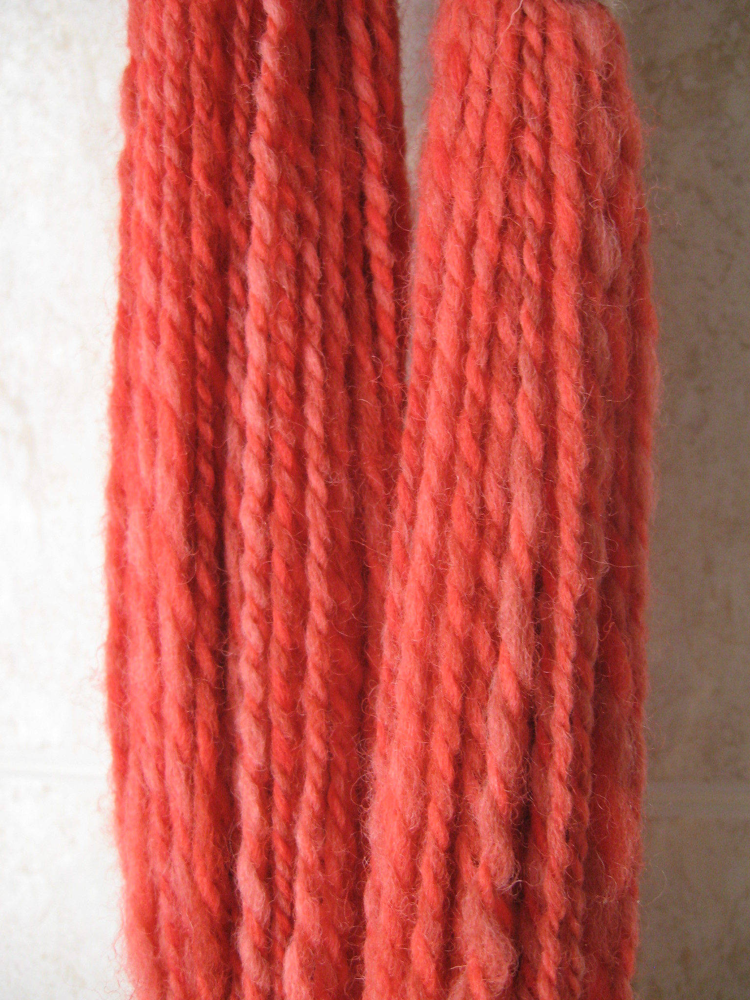

# Plied Yarn

2-ply yarn. If you look closely, you can see the two individual singles strands twisted together. Image Credit: Natalia Wilson on Flickr.

The yarn or thread that you purchase for projects just as knitting, sewing or weaving is plied meaning that it has been created through a process of [plying](../process/plying/) several [singles](singles.md) yarns and/or [filaments](filament.md) together. A 2-ply yarn is made of 2 singles, a 3-ply is made of three singles and so on. In some cases, yarns that have already been plied together can then be plied together another time to create "cabled" yarn structures. So, to make a yarn with 4 plys, one has the option to either ply four singles together at once or make 2, 2-ply yarns and later ply them again into a single 4-ply yarn. The first is called 4-ply, the second 2x2ply. The cabled yarns will be more durable than the 4-ply yarns.

_This photo is of a conductive silver yarn reveals a cabled structure where filaments are loosely twisted and then again twisted again into a more complex structure._

You can find another description of plied structures [here](https://www.thesprucecrafts.com/what-is-plied-yarn-2116148#:~:text=Plies%20are%20the%20individual%20strands,doesn%27t%20make%20much%20sense.) and a description of [cabling](https://knitty.com/ISSUEdf10/KSFEATdf10glossary.php) [here](https://knitty.com/ISSUEdf10/KSFEATdf10glossary.php).

_This structure contains two linen singles that are plied with a stainless silver strand_

### **Primary Measurements**

Note, yarns tend to be described differently by their suppliers and the application that they intend for the yarn to be used within. However, any yarn can be used for any application.

* **wraps per inch:** A measure of yarn width calculated as the number of wraps of the yarn that can fit within an inch at a neutral tension. You can find a demonstration [here](https://www.youtube.com/watch?v=G4MuKCCNoCk).
* **gauge \(knitting\)**: A measurement of yarn weight oriented towards knitting: [https://www.craftyarncouncil.com/standards/yarn-weight-system](https://www.craftyarncouncil.com/standards/yarn-weight-system)
* **ratios \(weaving\)**: weaving yarns are sold with measurements describing the weight of the yarn and number of plys within the structure. This includes measures like 20/2 Cotton or 10/2 tencel. The numerator describes the weight of the yarn, with _higher_ numbers indicating _finer_ weight. The denominator describes the number of plys:[ https://spinoffmagazine.com/yarn-numbers-mean-weaving-yarns/](https://spinoffmagazine.com/yarn-numbers-mean-weaving-yarns/)
* **ratios \(Conductive Yarns/Filaments\):** Some sellers of conductive yarns also follow this convention, only their numbers are a bit more wild like [117/17 Silver 2-ply](https://www.shieldextrading.net/products/yarns-threads/) or something wild. [Kobakant](https://www.kobakant.at/DIY/?p=379) helped me understand this by noting that the numerator indicates the Denier, the denominator is the number of _filaments_, and the 2-ply describes the number of plies. According to [Shieldex](https://www.shieldextrading.net/products/yarns-threads/), the denier applies to only one of the plies, meaning that the actual weight would need to be multiplied by 2.  I can't say I totally understand this but for the product above, I would guess it means that 17 filaments make up each "ply" within the two ply structure \(meaning the total number of filaments in the thread overall is 34. This is the weight prior to being coated with silver.  I still find this so confusing and it seems to shift by retailer. 
* **cross-sectional width \(Conductive Yarns/Filaments\):** To add another hitch to our measuring questions, sometimes resellers will describe their yarns/wires in terms of the diameter in microns or expressed as [AWG](https://en.wikipedia.org/wiki/American_wire_gauge), which is a measure that corresponds to the diameter of a cross-section of the wire but is wacky in that it scales logarithmically. The rule of thumb for me, using copper, is that the higher the number the thinner the wire. 40 AWG copper is about as thin as my hair and breaks easily. Something between 36-28 AWG has been the ideal for textile work as it is relatively strong yet also very thin and workable into the textile structure.
* **linear resistance \(conductive materials\):** conductive materials can also be described by their linear resistance which is the amount of resistance \(in Ohms\) per unit length. This measure depends on the material and construction and will also vary with the amount of force applied to the yarn. As [Anita Vogl very well explains in her talk comparing different structures for conductive stretch sensors](https://www.youtube.com/watch?v=AdM6I8fYB3E) \(@ 2:00minutes\). She gives and explanation of  how staple fibers will lower resistance when stretched because the air between fibers will be condensed, putting the fibers into closer contact and creating more pathways for electricity to flow.  \__\*\*_\_Filament based yarns become narrower when pulled, creating smaller cross-sectional width and, therefore, will raise resistance on stretching. 

