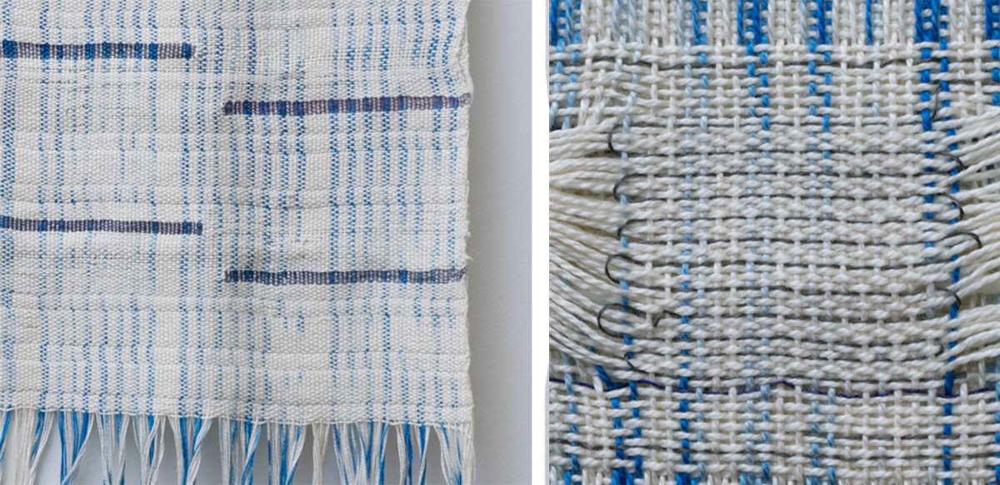

# Woven

A woven textile structure is created by interlacing material \(most often [plied yarn](plied-yarn.md) and[ filaments](filament.md)\) in two directions: the _warp_ \(threads running along the length\), and _weft_ \(threads running along the width\). These structures are created by stretching or "warping" a set of parallel yarns \(or radical yarns in circular weaving\), and then interweaving the weft yarns in a perpendicular direction to bind the textile together. The specific patterning of "overs" and "unders" gives the woven textile different thicknesses, ability to sheer, and durability, etc.

Because of their durability and less stretchy structure, woven fabrics are commonly used in upholstery, denim, and tailored garments like suits. They are also used in industrial applications to create composite materials or abrasion resistant pads or architectural materials \(e.g. wire meshes, etc\).

Woven structures are not inherently as stretchy as knits and the structure of weaving equipment makes working with stretchy materials challenging. Yet, like knitting, woven structure can be varied across the surface of a fabric giving rise to materials that have different mechanical properties in various regions.  
One of the strengths of weaving is its ability to easily create multi-layered structures, where multiple layers and interlacements of layers can be woven at one time. This allows for pockets and tubes to be easily embedded into the structure of a woven fabric, a technique that is often used for the creation of quilted fabrics but can also be used for multi-layered woven circuits.

Because woven tend not to be stretchy and require less knotting or looping of materials \(in most cases\), weaving is often preferable for brittle materials or materials that do not bend well. Furthermore, the process of weaving makes it easy to integrate a wide variety of materials with a wide variety of widths into the structure, creating interesting textures and methods for integrating "hard" materials into their soft structure.

Wovens are described by the materials, equipment \(e.g.yarn density represent\) and stitches used expressed in the form of [weaving patterns]().

**Woven Structure Inspirations:**

* Sheila Hicks [https://www.sheilahicks.com/](https://www.sheilahicks.com/)
* Lenore Tawney [https://lenoretawney.org/](https://lenoretawney.org/)
* Annie Albers [https://albersfoundation.org/](https://albersfoundation.org/)
* Gunta Stolzl [https://www.guntastolzl.org/Works](https://www.guntastolzl.org/Works)
* Beryl Korot [https://art21.org/artist/beryl-korot/?gclid=EAIaIQobChMIs7bzqa-E6wIVjYbACh0\_NAPCEAAYASAAEgKVMfD\_BwE](https://art21.org/artist/beryl-korot/?gclid=EAIaIQobChMIs7bzqa-E6wIVjYbACh0_NAPCEAAYASAAEgKVMfD_BwE)
* Textiel Lab Sample Studio: [https://samplestudio.textiellab.nl/samples/](https://samplestudio.textiellab.nl/samples/)

### Primary Measurements:

* woven fabrics are best expressed as [patterns]() or "drafts". Often, the draft is accompanied by details about the specific loom and materials used. These include "epi"  \(the number of warps/ends per inch\), as well as the materials used within each pic of the construction. 

