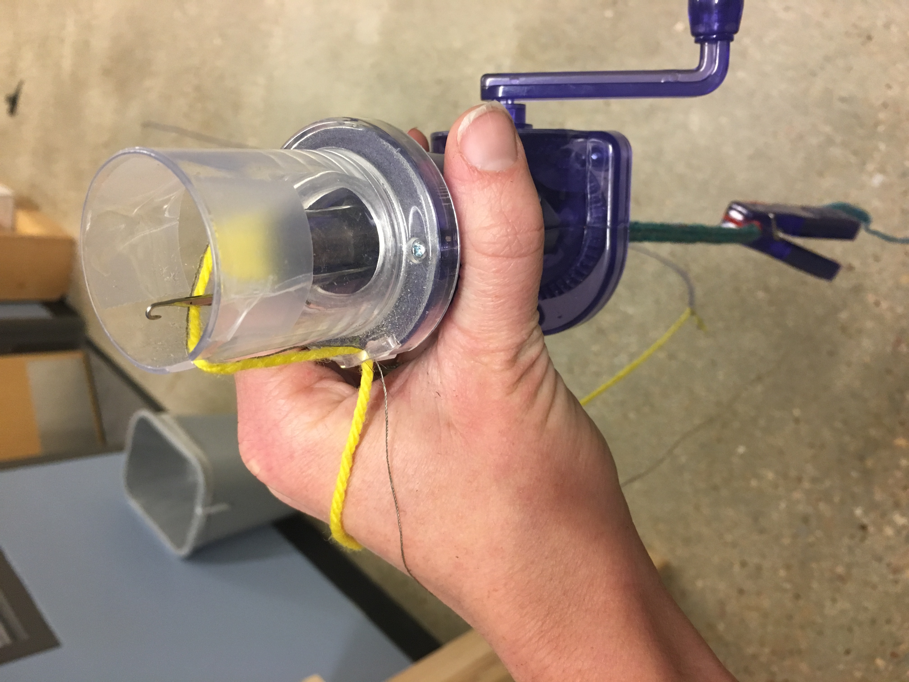

# Ply and Braid

As we have surveyed projects that use active or "smart" materials within textile structures, we tend to see two kinds of projects: \(1\) those that focus exclusively on the structure and composition of a yarn \(often leveraging braids\) and \(2\) those that use more conventional yarns and integrate them within a fabric to give some sort overall effect, say, touch sensing distributed across the fabric. Other times, you will buy smart fabrics only to find it was created with standard materials and simply sprayed or coated with something to make it conductive \(which then comes off on your hands\). 

There is a huge opportunity to here to think about textiles from the fiber up and you can't do that unless you consider a critical intermediary: yarn. Most of the yarns we use today, or that are used to make smart product concepts are either plied or braided into compound structures that suit our application. For knitting a winter scarf, this might be a airy and light wool. For figuring out how to make your charging cords interaction, this includes cotton mixed with fiberoptic cables. In fact, the materials we can use to make yarn are quite wide and include biomaterials, fishing line, tubing, hair, and so on. This chapter will help us understand the kinds of techniques that can help us make and experiment with these structures as well as terminology we can use to describe what we have made. 

If you are looking for a bit of motivation before we begin learning techniques, the following applications give you a sense of what is possible using these techniques:













## Making Yarn, Cable and Rope Structures 

Singles, the first stage yarns created just after spinning are not very strong, as the only thing holding fibers together is the twist. Commonly, these singles are spun into larger, stronger structures. There are several techniques to create these structures and each can work with singles, filaments or a combination of both. The first technique is **plying,** where the yarns are twisted into each-other to create stability. The second is **cabling**, where multiple plied strands are plied again into each other. The third is **braiding**, where a circular braid, like a finger trap, is created to give structure and stability.  

#### Key Terms

The direction that the singles or ply twists matters as you add additional structure to the yarn. **Twist,** in yarn, is typically **described as "Z' twist or "S" twist**. Thus, relative to how you are looking at the yarn, does the winding look more like a Z or an S. This twist makes a difference in how the more compound yarn structures are formed, and also can be leveraged in processes of weaving, where the twist structure allows fabrics to take on three dimensional properties. 

Yarns are also created by building up and around other yarns and structures. Smaller yarns make bigger yarns etc. In general, there are two parts one can design in a yarn: **a core** and **a sheath**. Some yarns are consisting of a core and have no sheath. Their structures are solid \(no hollow\) and all the fibers wrap, meaning nothing consistently through the center of the structure. Some yarns are **core-spun**, in which a braid or ply is created as a sheath outside of a single and central core material. Others are hollow, in which the filaments and fibers are twisted around an empty core, allowing you to potentially insert something and have it be completely covered by the sheath. 

### **Plying**

The first technique we'll cover is plying. Plying consists of twisting multiple singles together. You can make cores and core-spun yarns using plying, but you cannot make hollow structures. You can ply with 2, 3, or however the hell many yarns you like, but its probably best to stay on the small side \(under 6\) to keep structure if you are doing this somewhat freehand. For bigger yarns or projects, you'll often see plies of plied yarn which are technically called "cabled" yarns. This is a yarn that is made by plying together previously plied yarns. 

If you want to ply yarns together, here is what you do. Each of the singles strands is twisted in one direction \(lets say Z twist\), independently of the other. Once they are all twisted to the desired angle the counter-acting twist is applied from the joined end in the opposite \(or in this case S-direction\) and propagates through the singles, joining them together.

The best video I found demonstrating this process comes from a demonstration of medieval rope making. This shows how six plys are twisted in unison and come together to form a solid yarn/rope as a core. 



Different equipment allows for different qualities and lengths of yarn to be produced more easily. Here are some techniques you could use or investigate: 

#### Plying on a Spinning Wheel

If you were an elegant and details oriented spinner you would likely ply using a spinning wheel. This has the advantage of creating long lengths of consistently \(with skill\) plied yarn. The downside is that it requires a spinning wheel which you may not have. 



You can also create core-spun yarns using a spinning machine by plying or [adding fibers directly from top or roving around a solid and continuous core](https://www.mybluprint.com/article/core-spinning-yarn). This solid core is a useful structure when you want something to be fully encased in a fiber and/or when your core has very different material properties to your fibers. 

#### Spinning with A Drop Spindle

A drop spindle provides a more accessible way of creating long-ish lengths of consistently spun yarn but also requires a bit of practice. [Anne-Marie Lavigne](http://emeteuz.com/woven-signals) shows us how this comes in hand when we need to make long lengths of our own conductive thread:



In this video, she is hand spinning heating wire for activating thermochromic pigments on yarn. By spinning the materials together \(instead of ironing a heating element on the back of the fabric\) she's ensuring there is really good transfer between the yarn and the heating element. As we found in our own studies, any air that comes between these two can drastically extend or reduce the activation time for the yarn to change color.

If you want to get a feel for this, take any string or yarn you have nearby, twist it as much as you can between your hands and then fold it, holding the two ends in one hand and the fold in the other. You can watch the ply twist into itself to achieve balance, and if you feel like it, you can help it along and see even more twist.  

#### Ad Hoc Setups 

And if you were a bit more hasty or resource constrained you could follow each of these techniques. Both are a bit limited in the sense that you have a fixed length to work with. 

This Instructables demo shows a nice contraption for plying a variable number of yarns together. Ideally, the yarns would be equally spaced along the outer edge of a circle but this seems to get the job done for a proof of concept. 



This video uses a drill, because it will go super fast \(but I think maybe too fast to be helpful\) and does a nice job of creating an even spacing between the hooks. The result however, is very inconsistent likely as a result of lack of experience and, I imagine, the fixed end point of all the yarns. Now if you wanted your rope to ply around a solid core, you could basically add a fourth "core" yarn directly in the center of the other three. This yarn would not twist with the others, and if you kept it at tension, the other yarns would start forming around it when relaxed. 



I tried to make my own heating yarn using an Incredible rope machine,  which allows you to ply size strands together. I added in magnet wire and mercerized cotton for the strands and it was really tough \(because I couldn't keep tension\). In hindsight, I think some of the challenge was that I tried the use yarn that was already plied \(2-ply\) so the yarn's own twist might have made the structure unravel. It came put something like this: 

### Braiding 

Braiding is a technique that uses coils multiple strands, in different twist directions around a solid or hollow core. Industrial braiding uses a machine called a "[maypole machine](https://www.youtube.com/watch?v=SKHuZEhrQ2E)" that is utterly fascinating to watch. Braiding is often used for creating sheaths around a core. What is nice about braiding is you can have a core that is a completely different material than the sheath without having to wrestle with too many different issues in tensioning. I have never worked with an industrial braiding machine, but making braided tubes by hand has opened up a lot of possibilities for experimenting with integrating many different materials. 

Braiding machines have yet to enter the DIY marketplace \([and this one is out of stock!](https://www.kickstarter.com/projects/mixedmediaeng/rope-omatic)\), but we can create small samples at least using a technique called **Kumihimo.** Kumihimo braiding is a technique in which several lengths of yarns are braided into hollow tubes. Kumihimo templates can be used to create braids with custom textures and patterning. The templates are easy to produce in cardboard on a laser cutter at various thicknesses. During this braiding, the maker has more control over tensions than they might with techniques that spin yarns together, thus, they may be ideal for applications that require brittle materials to be integrated into the outer structure of the yarn. It is also nice because it can adapt to several different numbers of individual yarns composing the braid. If you want to braid around a core, you simple pace your core material through the hole in the center and while you are braiding, it will wrap around that core on its own. A special thank you to [Pamela Liou](https://pamelaliou.com/) who was the first to introduce me to Kumihimo. There are many [patterns available online](https://prumihimo.com/resources/braiding-patterns/) that allow you to create braids with different cross sections ranging from square to semi-circular. 

### I-Cords

One final structure that may be useful, and it at least easier to prototype is a knitted i-cord. This structure is hollow with a knitted sheath. Unlike the other two structures, this sheath is quite stretchy. The downside is that the yarn will be a bit fat \(by yarn standards\). The structure can be created by [hand techniques](https://www.youtube.com/watch?v=dfkFRa9tjns) or with wonderful little contraptions like and [embellish-knit ](https://www.studioknitsf.com/embellish-knit-cords-power-tools/)hand cranked i-cord maker. Traditionally used to make little pulls, like the ones on a hoodie, they can also be useful in creating yarn-like structures. When working by hand, you have much more flexibility with the materials and sizing of the cord. With some finessing, you can feed the machine \(or a hand knitter\) both conductive and non-conductive materials at the same time to create a conductive cord structure. This structure has been really useful for acting as a pull or strain sensor, or, when tied around my ribcage, makes a pretty robust breath sensor. The measuring works through resistive sensing. The knitting structure basically maximizes the length of the conductive thread. So when the cord is strained, it strains all fibers of the conductive yarns, tightening their structure and lowering the overall resistance .  

Because of the hollow structure, it is also possible to add a cord within the sheath. I have found  it most useful to add this core at the time of knitting, rather than trying to feed it through after. In one project, we used conductive materials in the core AND the sheath to create a string that [would know something of its own shape. ](application-a-string-that-knows-its-shape.md)

**Summary**

Each technique has its strengths and weaknesses. The [string figure senso](application-a-string-that-knows-its-shape.md)r could have been made with knitting, braiding or plying, though, knitting provided us the best way to integrate our core most quickly. In other cases, you may especially need one technique more than the other. For instance, the knitting structure \(I think\) is the only one that could give us the quality of breath readings we needed because of its ability to stretch and place tension on long lengths of conductive yarn. For [McKibben muscles](application-artificial-muscles.md), you must have braids made of material that "slides" well on itself so it can dramatically change its diameter when compressed.  

It is also important to note that there are likely a number of techniques that I have left out. For instance, how spinning different types of yarns or fibers and filaments together create really textured "boucle" yarns, how co-axial cables and other systems are made using wires as well as coatings, or even the [mystical processes that give us things like pipe-cleaners](https://www.youtube.com/watch?v=fPt-gwH3SVQ) \(a wire core spun with tufts of fun?\)

## Describing Yarns

So now that we understand that yarns are made of twisted fibers, which have then become into much larger and stronger plied or cabled fiber, we may come to understand the numbers that people use to describe yarns. This is especially helpful if you want to order materials and need a way to understand what it is you are buying. 


Describing yarns varies widely by the company and the envisioned application for the materials. Thus, some people will tell you a diameter of a yarn/wire while others will use more traditional measures indicating yarn weight and number of plys. Furthermore, the kind of measures used for knitting are a bit different than those used for weaving yarns, even though you can knit or weave with any of them.


Part of the reason these measures are so convoluted is that they are not exactly rigid. For instance, your yarn will stretch and puff as you knit or weave it, it will depend on your tensioning, etc. Its all a delicate balance. So its bad for universal measures, but good for improvisation. 

Typically, when you order yarn, you will be given a set of measures including \(but not limited to\):  

[Gauge](https://www.craftyarncouncil.com/standards/yarn-weight-system): This measures how many stitches \(knitting\) you can fit within a four inch row of stockinette knit. Some brands only tell you how many stitches in a single inch. The category of gauge is one of the most common when purchasing yarn, [and also determines the category name of the yarn \(e.g. sport weight\) and the recommended size or your tools](https://www.craftyarncouncil.com/standards/yarn-weight-system). 



[Wraps per inch](https://www.craftyarncouncil.com/standards/how-measure-wraps-inch-wpi): This measure the width of the yarn and is complementary to, but not replaceable by the gauge. It is measured by counting how many wraps you can make around a length of 1 inch. When measuring yourself, you must be careful how much you  pull the yarn, as it will change this measure. Best to shoot for a tension somewhere in the middle. T[his chart relates yarn weight \(e.g. Bulky\) to different numbers of wraps per inch](https://www.craftyarncouncil.com/standards/how-measure-wraps-inch-wpi). 



[Ratios \(Traditional Weaving Yarns\)](https://spinoffmagazine.com/yarn-numbers-mean-weaving-yarns/): Weaving yarns are often sold with a ratio in their name, such as "8/2 Tencel Yarn" or "20/2" Cotton. The denominator \(bottom\) number in this ratio tells you the number of plies of singles yarn they contain. So both 8/2 and 20/2 yarns have 2-plies. The numerator describes the thickness of the yarn, based on the thickness of the singles. A measure of 1 would be the thickest possible singles. So, the higher the number, the thinner each individual ply is. 

[Ratios \(Conductive Yarns/Filaments\)](https://www.kobakant.at/DIY/?p=379): Some sellers of conductive yarns also follow this convention, only their numbers are a bit more wild like 117/17 Silver 2-ply or something wild. [Kobakant](https://www.kobakant.at/DIY/?p=379) helped me understand this by noting that the numerator indicates the Denier, the denominator is the number of _filaments_, and the 2-ply describes the number of plies. Denier is the mass in grams of 9000 meters. [The measure is based on a single thread of silk, which has a denier of 1](https://en.wikipedia.org/wiki/Units_of_textile_measurement). Some indicate that they use d-tex instead of denier which is the mass per kilogram \)10000 meters. I can't say I totally understand this but for the product above, I would guess it means that 17 filaments make up each "ply" within the two ply structure and each of those groups of 17 filaments has a Denier of 117. I still find this so confusing. 


Conductive threads, especially when they are filament based, are often materials such as nylon that have been plated with a thin coating of metal. They are not typically solid metal \(though you can find solid metal in threads through some supplies\). 


[AWG](https://en.wikipedia.org/wiki/American_wire_gauge): To add another hitch to our measuring questions, sometimes resellers will describe their yarns/wires in terms of AWG, which is a measure that corresponds to the diameter of a cross-section of the wire but is wacky in that it scales logarithmically. The rule of thumb for me, using copper, is that the higher the number the thinner the wire. 40 AWG copper is about as thin as my hair and breaks easily. Something between 36-28 AWG has been the ideal for textile work as it is relatively strong yet also very thin and workable into the textile structure.

